# Conception et mise en oeuvre des modules Data Science et Intelligence Artificielle

## 1. Introduction

Le projet **Smart Farm AI** propose une plateforme intelligente destinée à la
gestion et à la surveillance d'une exploitation agricole. La composante
Data Science et Intelligence Artificielle repose principalement sur deux types
de données :

- des images utilisées pour la détection d'animaux, de maladies et d'insectes ;
- des séries temporelles issues des capteurs IoT de l'exploitation.

L'objectif est d'aider le propriétaire de la ferme à prendre des décisions plus
rapidement, tout en fournissant aux ouvriers des informations utiles pour les
interventions sur le terrain. Les modèles développés couvrent notamment
l'apiculture, l'aviculture, les maladies caprines, les maladies végétales et la
détection d'insectes ravageurs.

## 2. Démarche méthodologique

La démarche adoptée suit un cycle expérimental inspiré de **CRISP-DM** :

1. compréhension du besoin métier ;
2. collecte et compréhension des données ;
3. préparation et contrôle de la qualité des données ;
4. entraînement des modèles ;
5. évaluation quantitative et qualitative ;
6. déploiement et surveillance des modèles.

Les données, paramètres et résultats sont versionnés afin de garantir la
reproductibilité des expériences. Le suivi du cycle de vie des modèles est
complété par un mécanisme d'active learning, permettant de réutiliser les
corrections humaines et les nouveaux exemples collectés sur le terrain.


*Figure 1 — Pipeline MLOps et amélioration continue des modèles de Smart Farm AI.*

## 3. Jeux de données

### 3.1. Dataset apicole BeeData

Le module apicole utilise un dataset organisé selon le format YOLO avec trois
sous-ensembles : entraînement, validation et test. Quatre classes sont
considérées :

- `bee` : abeille ;
- `drone` : faux-bourdon ;
- `pollenbee` : abeille transportant du pollen ;
- `queen` : reine.

Le problème est formulé comme une tâche de détection orientée
**OBB — Oriented Bounding Boxes**. Cette représentation est adaptée aux
abeilles, car leur orientation peut varier fortement dans l'image.

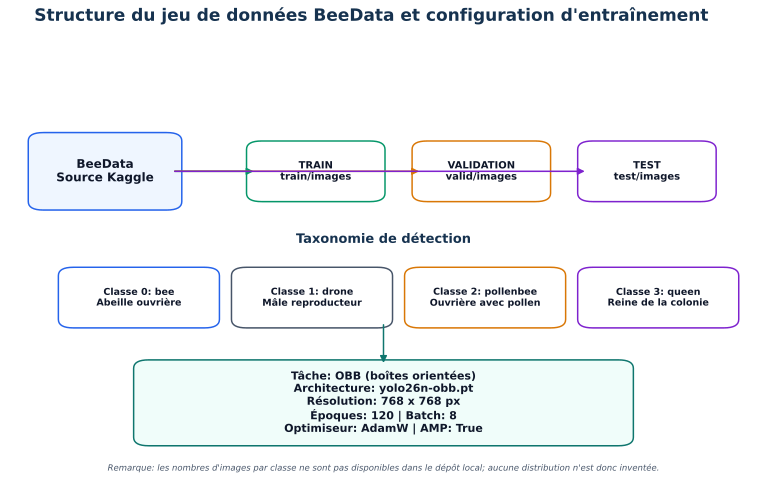

*Figure 2 — Organisation du dataset apicole et configuration YOLO OBB.*

Les images brutes de BeeData sont référencées depuis Kaggle, mais ne sont pas
présentes dans le dépôt local. Par conséquent, aucune estimation non vérifiée
du nombre d'images par classe n'a été introduite dans cette étude.

### 3.2. Données de télémétrie apicole

Le dataset de télémétrie contient **2 000 observations** chronologiques. Chaque
observation regroupe les variables suivantes :

- température ;
- humidité ;
- poids de la ruche ;
- niveau sonore.

L'analyse exploratoire permet d'étudier l'évolution temporelle des mesures,
leurs distributions et leurs corrélations. Cette étape sert à identifier les
valeurs atypiques, les dépendances entre variables et les transformations
nécessaires avant la modélisation.

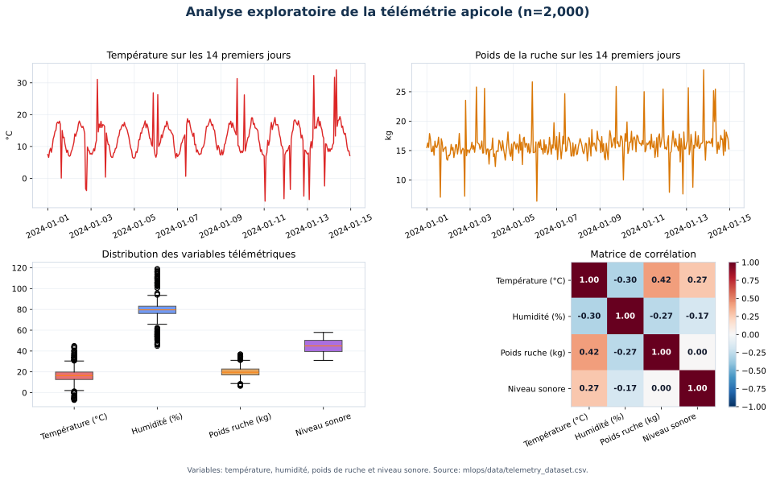

*Figure 3 — Analyse exploratoire des 2 000 observations de télémétrie apicole.*

### 3.3. Datasets de vision agricole

Plusieurs datasets spécialisés ont été employés pour entraîner les modèles de
vision par ordinateur.

| Domaine | Nombre de classes | Exemples de classes |
|---|---:|---|
| Poulet | 6 | Chicken Favus, Fowl Pox, coryza, CRD, normal, weak leg |
| Chèvre | 5 | Cheesy gland, ecthyma contagieux, poux, gale, teigne |
| Citronnier | 9 | anthracnose, chancre, feuille saine, acariens |
| Oranger | 3 | classes de maladies des feuilles d'oranger |
| Insectes | 10 | army worm, red spider, rice leaf roller, rice borer |

La séparation des données en ensembles d'entraînement, de validation et de test
permet d'entraîner les modèles, de sélectionner les meilleurs poids et
d'estimer leur capacité de généralisation.

## 4. Préparation des données

Les principales opérations de préparation appliquées aux données visuelles
sont :

- redimensionnement des images à `768 × 768` pixels pour la majorité des modèles ;
- redimensionnement à `640 × 640` pixels pour le modèle de détection d'insectes ;
- vérification des annotations et des noms de classes ;
- augmentation des données par translation, changement d'échelle et retournement ;
- utilisation de Mosaic et, selon le modèle, de MixUp ;
- normalisation automatique des images par la chaîne de traitement YOLO.

L'augmentation des données améliore la robustesse face aux changements
d'éclairage, de position, d'échelle et d'orientation observés dans les
conditions réelles d'une exploitation agricole.

## 5. Architecture et entraînement des modèles

Les modèles de détection sont principalement basés sur l'architecture
**YOLOv11n**. Cette version légère offre un compromis entre vitesse
d'inférence, consommation de ressources et précision, ce qui facilite son
intégration dans une application web ou un environnement à ressources limitées.

Les principaux hyperparamètres communs sont présentés ci-dessous.

| Paramètre | Valeur principale |
|---|---|
| Architecture | YOLOv11n |
| Optimiseur | AdamW |
| Batch size | 8 |
| Nombre d'époques | 100 à 120 |
| Learning rate initial | 0,001 |
| Weight decay | 0,0005 |
| Taille des images | 640 ou 768 pixels |
| Validation | Après chaque époque |

Pour le modèle apicole, l'architecture **YOLO OBB** est utilisée afin de
prédire des boîtes englobantes orientées.

## 6. Évaluation des modèles

### 6.1. Métriques utilisées

Les modèles sont évalués à l'aide de quatre métriques principales :

- **Précision** : proportion des détections produites qui sont correctes ;
- **Rappel** : proportion des objets réels correctement détectés ;
- **mAP@0.50** : précision moyenne avec un seuil IoU fixé à 0,50 ;
- **mAP@0.50:0.95** : moyenne des performances pour plusieurs seuils IoU,
  constituant une mesure plus stricte.

Le suivi conjoint de ces métriques permet d'éviter une interprétation basée sur
un seul indicateur. Une précision élevée réduit les faux positifs, tandis qu'un
rappel élevé limite les objets non détectés.

### 6.2. Résultats du modèle apicole

L'entraînement du modèle apicole a été réalisé pendant 120 époques. La meilleure
performance a été observée à l'époque 118.

| Indicateur | Résultat |
|---|---:|
| Précision | 0,809 |
| Rappel | 0,748 |
| mAP@0.50 | 0,816 |
| mAP@0.50:0.95 | 0,630 |

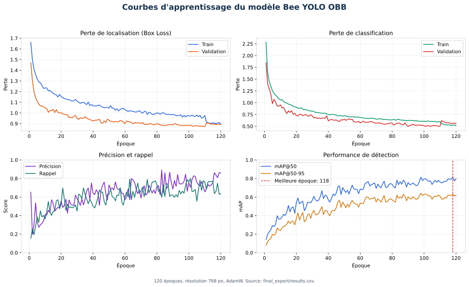

*Figure 4 — Évolution des pertes et des métriques du modèle de détection des abeilles.*

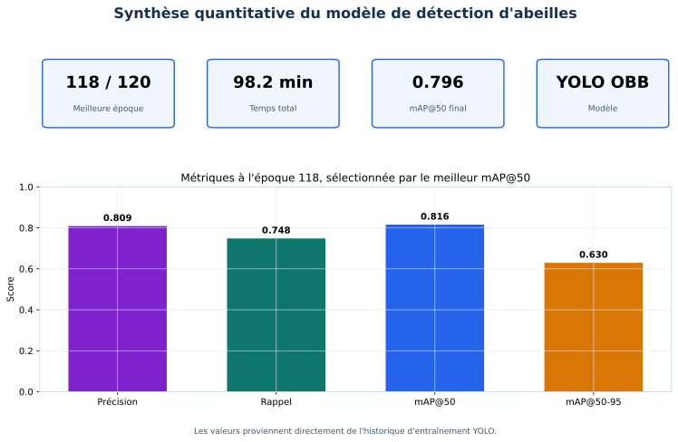

*Figure 5 — Synthèse quantitative des meilleures performances du modèle apicole.*

L'analyse qualitative confirme que le modèle peut localiser plusieurs abeilles
dans une même image et représenter leur orientation.

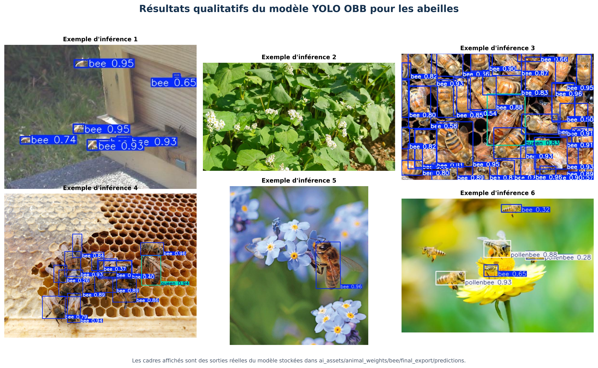

*Figure 6 — Exemples réels de prédictions du modèle YOLO OBB sur les abeilles.*

### 6.3. Résultats comparatifs des modèles YOLOv11

Le tableau suivant présente la meilleure époque observée pour chaque modèle.

| Modèle | Précision | Rappel | mAP@0.50 | mAP@0.50:0.95 |
|---|---:|---:|---:|---:|
| Poulet | 0,554 | 0,536 | 0,513 | 0,240 |
| Chèvre | 0,640 | 0,613 | 0,595 | 0,261 |
| Citronnier | 0,959 | 0,920 | 0,946 | 0,801 |
| Oranger | 0,609 | 0,510 | 0,572 | 0,423 |
| Insectes | 0,922 | 0,800 | 0,906 | 0,593 |

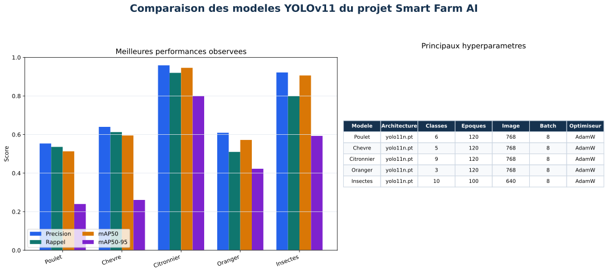

*Figure 7 — Comparaison des performances et des hyperparamètres des modèles YOLOv11.*

Les meilleurs résultats sont obtenus par le modèle du citronnier, avec une
mAP@0.50 de 0,946 et une mAP@0.50:0.95 de 0,801. Le modèle de détection
d'insectes présente également de bonnes performances. Les résultats plus
faibles des modèles poulet et chèvre peuvent être liés à la difficulté visuelle
des maladies, au déséquilibre des classes, à la variabilité des images ou à la
similarité entre certaines pathologies.

## 7. Analyse détaillée par domaine

### 7.1. Maladies du poulet

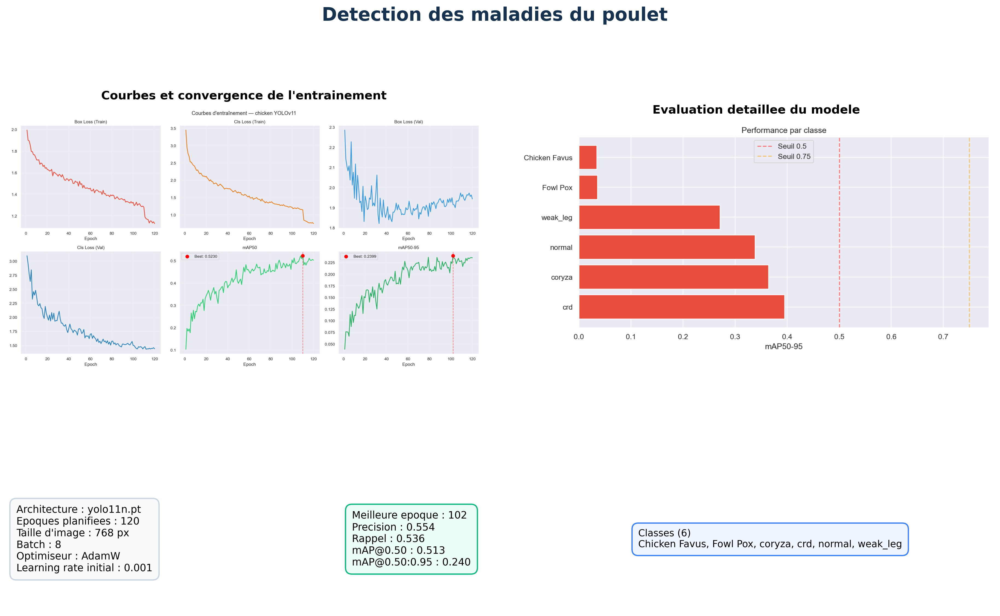

*Figure 8 — Courbes, performances par classe, paramètres et métriques du modèle poulet.*

Les performances varient selon les classes. Les catégories visuellement rares
ou proches d'autres maladies sont plus difficiles à détecter. L'ajout d'images
annotées et l'équilibrage des classes constituent les principales pistes
d'amélioration.

### 7.2. Maladies cutanées de la chèvre

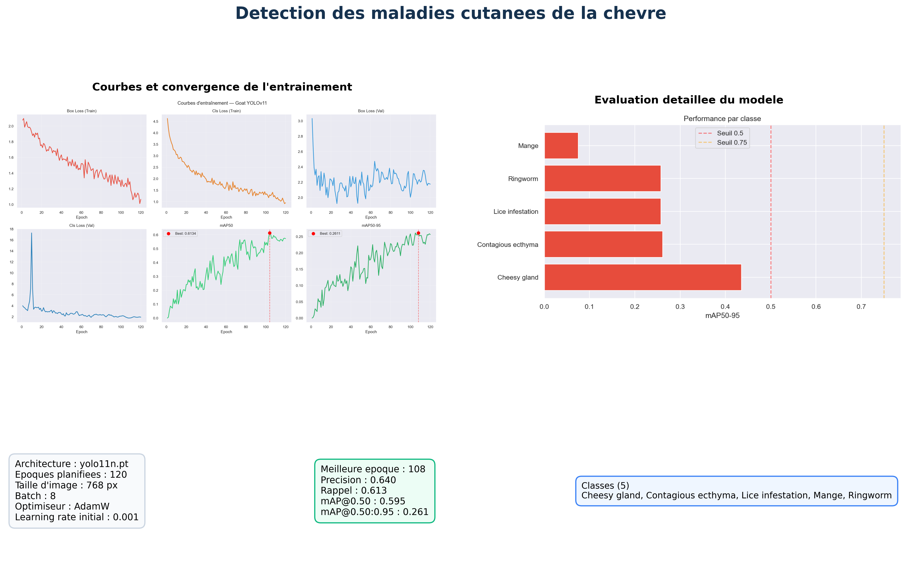

*Figure 9 — Résultats détaillés du modèle de détection des maladies caprines.*

Le modèle chèvre obtient une précision de 0,640 et un rappel de 0,613. La
performance par classe met en évidence une meilleure reconnaissance de
certaines pathologies et des difficultés sur les maladies moins représentées.

### 7.3. Maladies du citronnier

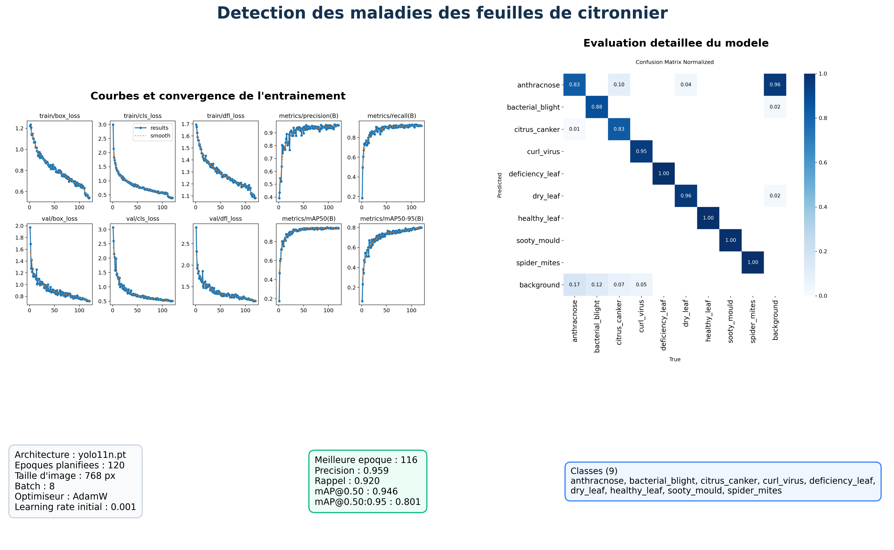

*Figure 10 — Courbes d'entraînement et matrice de confusion normalisée du modèle citronnier.*

La matrice de confusion présente une diagonale dominante, indiquant que la
majorité des classes sont correctement reconnues. Les principales erreurs
concernent les confusions avec l'arrière-plan et certaines maladies présentant
des symptômes visuellement proches.

### 7.4. Maladies de l'oranger

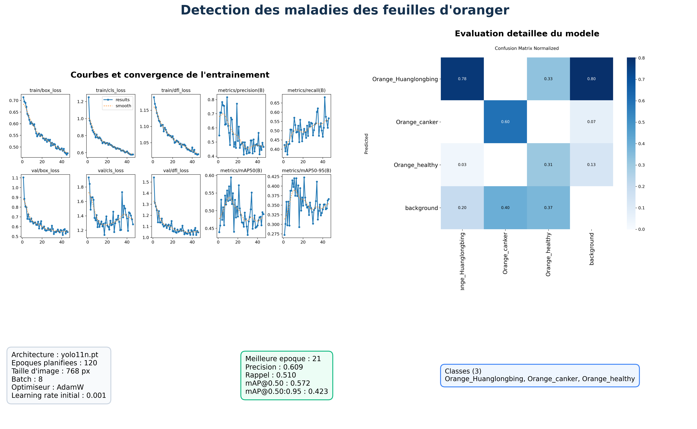

*Figure 11 — Évaluation du modèle de détection des maladies de l'oranger.*

Le modèle oranger obtient une mAP@0.50:0.95 de 0,423. Cette performance montre
que le modèle apprend les caractéristiques principales, mais qu'une
amélioration du dataset et des annotations reste nécessaire.

### 7.5. Insectes ravageurs

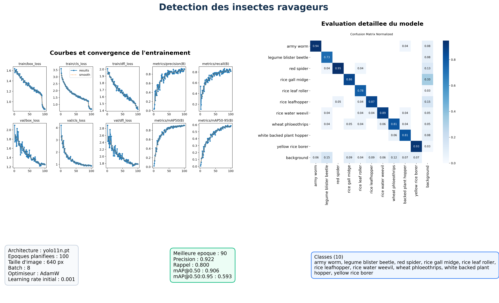

*Figure 12 — Courbes et matrice de confusion du modèle de détection des insectes.*

Le modèle insectes atteint une précision de 0,922 et une mAP@0.50 de 0,906.
Certaines erreurs avec l'arrière-plan persistent, notamment pour les insectes
de petite taille ou faiblement contrastés.

## 8. Détection non supervisée des anomalies

La télémétrie apicole ne possède pas nécessairement une étiquette pour chaque
situation anormale. Une approche non supervisée basée sur
**Isolation Forest** est donc utilisée pour calculer un score d'anomalie.

Avant l'apprentissage, les variables sont standardisées afin d'éviter qu'une
mesure possédant une grande échelle numérique domine les autres. Une projection
par analyse en composantes principales, ou PCA, facilite ensuite la
visualisation des observations normales et atypiques.

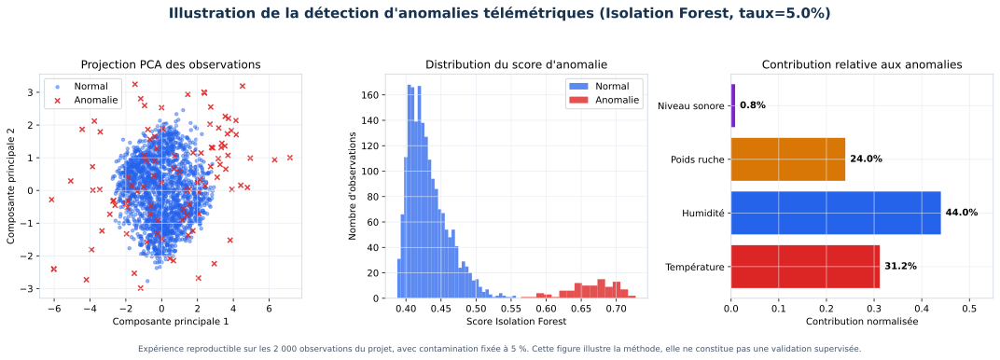

*Figure 13 — Détection non supervisée d'anomalies et projection PCA des mesures apicoles.*

Cette approche peut signaler une variation inhabituelle de température,
d'humidité, de poids ou de niveau sonore. L'anomalie doit ensuite être
interprétée avec les règles métier avant de déclencher une alerte ou une
recommandation.

## 9. Déploiement et intégration

Les modèles entraînés sont enregistrés sous la forme de poids `best.pt`. Le
backend FastAPI charge le modèle correspondant au domaine demandé et expose le
service d'inférence à l'application Smart Farm AI.

Le processus général est le suivant :

1. l'utilisateur transmet une image ou les capteurs envoient une observation ;
2. le backend valide et prépare les données ;
3. le modèle produit une prédiction ou un score d'anomalie ;
4. le résultat est enregistré et affiché dans l'interface ;
5. une alerte ou une recommandation peut être générée ;
6. la correction de l'utilisateur peut alimenter le processus d'active learning.

DVC assure le versionnement des données et des artefacts, tandis que MLflow
permet de suivre les paramètres, les métriques et les différentes expériences.
La détection de dérive surveille l'évolution des distributions et de la
confiance des prédictions après le déploiement.

## 10. Limites et perspectives

Les principales limites identifiées sont :

- le déséquilibre possible entre les classes ;
- le nombre limité d'exemples pour certaines maladies ;
- les différences d'éclairage et d'arrière-plan ;
- la similarité visuelle entre certaines pathologies ;
- la présence d'objets petits ou partiellement masqués ;
- l'absence de labels réels pour certaines anomalies IoT.

Les perspectives d'amélioration comprennent :

- l'enrichissement et le rééquilibrage des datasets ;
- la validation des annotations par un expert agricole ou vétérinaire ;
- l'utilisation de la validation croisée ;
- l'optimisation des seuils de confiance par domaine ;
- l'évaluation sur des images collectées directement dans la ferme ;
- la comparaison de plusieurs tailles de YOLO ;
- l'explicabilité des décisions avec des méthodes telles que Grad-CAM ;
- le réentraînement périodique à partir des corrections humaines.

## 11. Conclusion

La composante Data Science et Intelligence Artificielle de Smart Farm AI
combine la vision par ordinateur, l'analyse de séries temporelles, la détection
d'anomalies et les pratiques MLOps. Les résultats obtenus montrent la
faisabilité d'une assistance automatisée pour la surveillance des animaux, des
plantes, des insectes et des ruches.

Les modèles citronnier, insectes et abeilles présentent les performances les
plus encourageantes. Les modèles poulet, chèvre et oranger constituent des
prototypes fonctionnels qui pourront être améliorés par l'ajout de données
terrain. L'intégration du versionnement, du suivi expérimental, de la détection
de dérive et de l'active learning permet d'inscrire ces modèles dans un cycle
d'amélioration continue adapté à une ferme intelligente.
