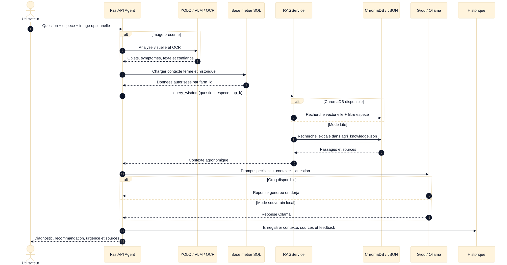
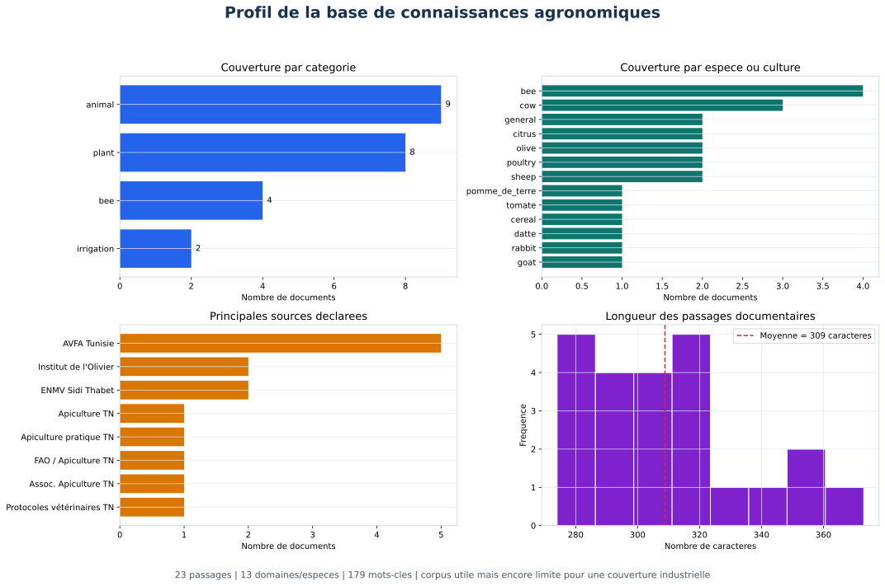
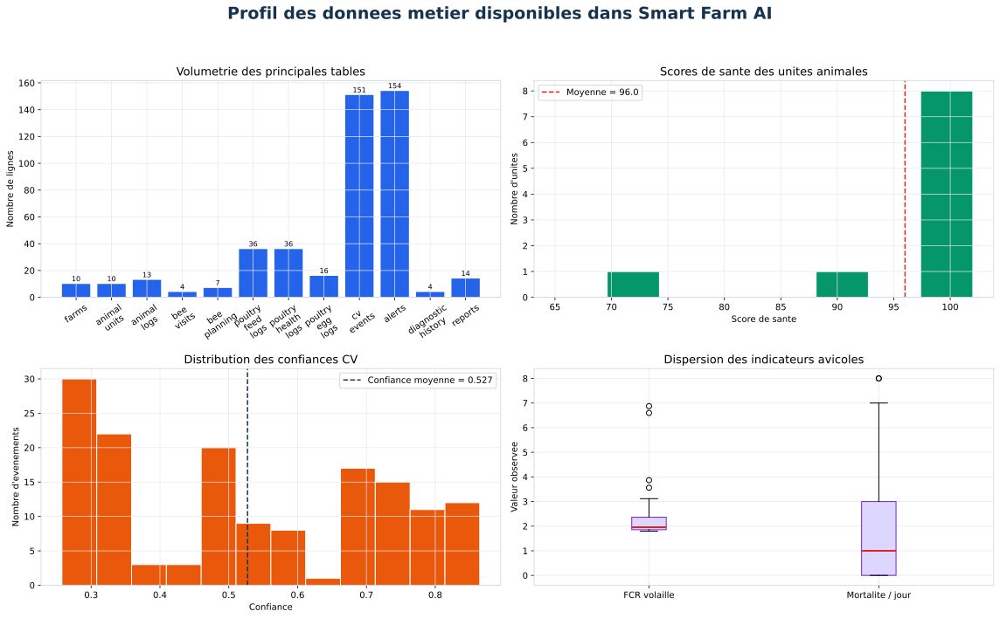
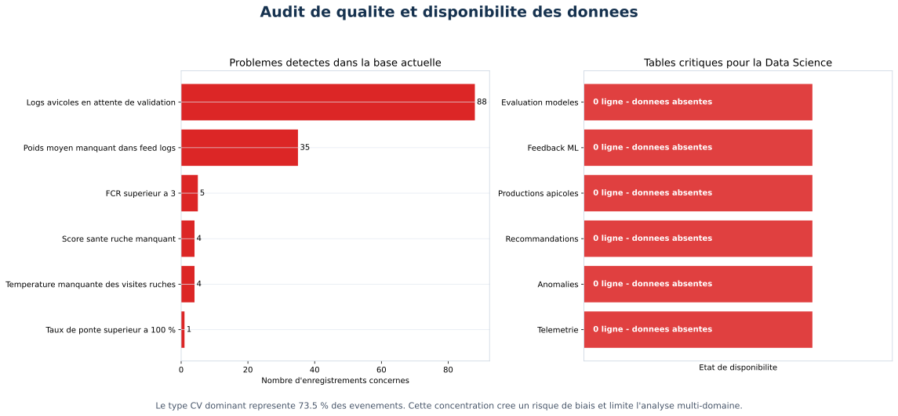
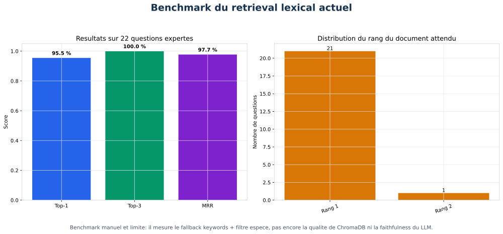
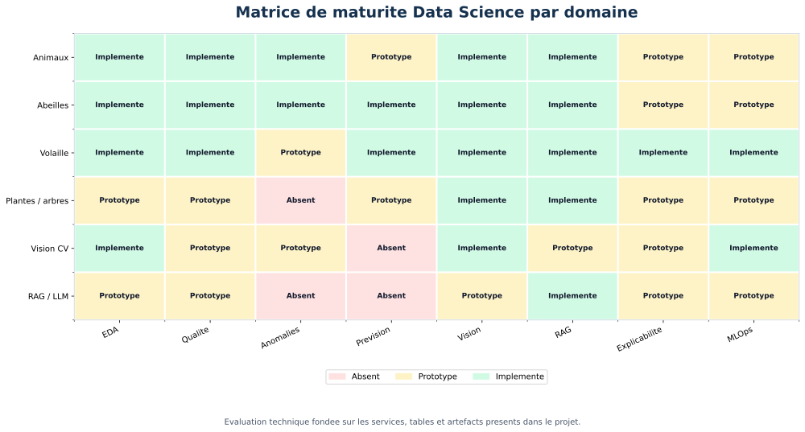

# Conception d'un système RAG et LLM multimodal pour Smart Farm AI

## 1. Introduction

Smart Farm AI centralise des données hétérogènes relatives aux animaux, aux
ruches, aux cultures, aux arbres, aux capteurs IoT et aux modèles de vision par
ordinateur. Un modèle de langage utilisé seul ne connaît ni l'état courant de
la ferme ni les documents agronomiques sélectionnés par l'organisation. Il peut
également produire une réponse plausible mais non supportée par une source.

Pour réduire ce risque, le projet utilise une architecture
**RAG — Retrieval-Augmented Generation**. Avant de produire une réponse, le
système recherche des passages pertinents dans une base de connaissances, puis
transmet ces passages au LLM avec le contexte de la ferme. Le système devient
ainsi capable de fournir des réponses contextualisées sur :

- les bovins, ovins, caprins, lapins et volailles ;
- les abeilles, les ruches et les visites apicoles ;
- les plantes maraîchères et les céréales ;
- les arbres, notamment l'olivier, les agrumes et le palmier dattier ;
- l'irrigation, la salinité et les conditions météorologiques ;
- les résultats des modèles YOLO et des analyses d'images.

Le RAG ne remplace pas l'expertise vétérinaire ou agronomique. Il constitue un
outil d'aide à la décision qui doit indiquer ses sources, son niveau
d'incertitude et les situations nécessitant une validation humaine.

## 2. Périmètre de l'étude

L'étude repose sur les artefacts réellement présents dans le projet :

- `backend/app/services/rag_service.py` ;
- `backend/app/services/agent_service.py` ;
- `backend/app/services/mllm_service.py` ;
- `backend/app/data/agri_knowledge.json` ;
- la base locale `backend/smart_farm.db` ;
- les modèles SQLAlchemy de `backend/app/models/domain.py` ;
- les services de qualité, prévision, anomalie, vision et active learning.

Les résultats sont séparés en deux catégories :

1. **système observé** : fonctionnalités et données effectivement présentes ;
2. **architecture cible** : améliorations recommandées pour une utilisation
   robuste avec import de documents ou de bases de données.

## 3. Architecture RAG et LLM actuelle

L'architecture combine quatre formes de contexte :

1. la question textuelle de l'utilisateur ;
2. les résultats de vision par ordinateur ou d'OCR ;
3. les données structurées de la ferme ;
4. les passages documentaires issus de la base agronomique.

*Figure 1 — Architecture multimodale du système RAG et LLM de Smart Farm AI.*

### 3.1. Retrieval documentaire

Le service `RAGService` propose deux modes :

- **mode vectoriel** : ChromaDB effectue une recherche par similarité cosinus ;
- **mode Lite** : une recherche lexicale est appliquée au fichier
  `agri_knowledge.json`, avec un score fondé sur les mots-clés et un bonus pour
  l'espèce demandée.

Cette stratégie de repli garantit un fonctionnement minimal lorsque ChromaDB
n'est pas disponible. Elle ne possède toutefois pas la capacité sémantique
d'une recherche par embeddings multilingues.

### 3.2. Génération par LLM

La chaîne de génération utilise :

- Groq et un modèle Llama en priorité lorsque le service cloud est disponible ;
- Ollama comme solution locale et souveraine ;
- une réponse statique de secours lorsque les deux services sont indisponibles.

Des prompts spécialisés sont définis pour les vaches, moutons, chèvres,
volailles, lapins, abeilles, plantes, oliviers, insectes et incendies. La
réponse finale est produite en derja tunisienne afin d'améliorer son
accessibilité pour les utilisateurs terrain.

### 3.3. Analyse multimodale

Lorsqu'une image est transmise, le système peut combiner :

- les détections YOLO ;
- un Vision Language Model ;
- l'OCR par Tesseract ou par modèle visuel ;
- les passages récupérés par le RAG ;
- un prompt métier spécialisé.

*Figure 2 — Séquence d'une question multimodale avec recherche documentaire et génération.*

## 4. Analyse de la base de connaissances

La base agronomique actuelle contient **23 passages**, répartis comme suit :

| Catégorie | Nombre de passages |
|---|---:|
| Animaux | 9 |
| Plantes et arbres | 8 |
| Abeilles | 4 |
| Irrigation | 2 |

Elle couvre **13 espèces ou domaines** et contient **179 mots-clés**. La
longueur moyenne d'un passage est de 309 caractères. Les sources déclarées
incluent notamment l'AVFA, l'ENMV Sidi Thabet, l'Institut de l'Olivier, les
CRDA, la FAO et des guides apicoles tunisiens.

*Figure 3 — Répartition des passages, espèces, sources et longueurs documentaires.*

### 4.1. Points positifs

- couverture de plusieurs domaines agricoles tunisiens ;
- présence de termes français, arabes et derja ;
- association de chaque passage à une espèce, un sujet et une source ;
- fonctionnement hors ligne possible ;
- corpus cohérent avec les fonctionnalités principales de Smart Farm AI.

### 4.2. Limites

- 23 passages constituent un corpus trop réduit pour une couverture experte ;
- certaines espèces ne possèdent qu'un seul passage ;
- les dates, éditions et URL précises des sources ne sont pas systématiques ;
- les arbres et plantes sont documentés, mais ne possèdent pas encore un
  modèle relationnel métier aussi détaillé que les animaux ou les abeilles ;
- les documents ne sont pas versionnés dans un catalogue documentaire ;
- aucune validation formelle par un agronome ou un vétérinaire n'est stockée.

## 5. Analyse de la base de données métier

La base locale contient des données structurées sur les fermes, les animaux,
l'apiculture, la volaille, les événements de vision, les alertes et les
rapports.

| Table ou domaine | Nombre de lignes |
|---|---:|
| Fermes | 10 |
| Unités animales | 10 |
| Journaux animaux | 13 |
| Visites apicoles | 4 |
| Planifications apicoles | 7 |
| Journaux d'alimentation volaille | 36 |
| Journaux de santé volaille | 36 |
| Journaux de ponte | 16 |
| Événements CV | 151 |
| Alertes | 154 |
| Historiques de diagnostic | 4 |
| Rapports | 14 |

*Figure 4 — Volumétrie et distribution des principaux indicateurs métier.*

Les dix unités animales possèdent un score de santé moyen de 96 sur 100.
Cependant, l'échantillon est réduit et toutes les unités sont marquées comme
`healthy`. Cette homogénéité peut refléter un fonctionnement normal, mais aussi
un biais de saisie ou un manque d'événements de santé enregistrés.

Les 151 événements CV concernent principalement la détection d'incendie. Leur
confiance moyenne est de 0,527. La classe dominante représente 73,5 % des
événements, ce qui rend la base peu représentative des autres domaines.

## 6. Audit de qualité des données

Une étude Data Science fiable commence par la validation des données. L'audit a
identifié les problèmes suivants :

| Problème | Nombre d'enregistrements |
|---|---:|
| Journaux avicoles en attente de validation | 88 |
| Poids moyen manquant dans les journaux d'alimentation | 35 |
| FCR supérieur à 3 | 5 |
| Température manquante dans les visites apicoles | 4 |
| Score de santé de ruche manquant | 4 |
| Taux de ponte supérieur à 100 % | 1 |

*Figure 5 — Problèmes de qualité et tables critiques actuellement vides.*

Six tables importantes sont présentes dans le schéma, mais ne contiennent
aucune ligne :

- `telemetry_records` ;
- `anomalies` ;
- `recommendations` ;
- `bee_productions` ;
- `ml_feedback` ;
- `model_evaluations`.

Cette absence empêche une validation réelle des prévisions, de la détection
d'anomalies, des recommandations et de l'active learning à partir de la base
opérationnelle. Des données de télémétrie existent dans les artefacts MLOps du
projet, mais elles ne sont pas encore chargées dans la table métier locale.

### 6.1. Contrats de données recommandés

Chaque table analytique doit disposer d'un contrat précisant :

- les champs obligatoires ;
- le type et l'unité de chaque variable ;
- les plages physiques valides ;
- la fréquence de collecte ;
- la règle de gestion des valeurs manquantes ;
- le responsable de validation ;
- la date et la version du schéma.

Exemples de règles :

- `production_rate` doit être compris entre 0 et 100 % ;
- le FCR doit être positif et les valeurs extrêmes doivent être contrôlées ;
- les visites apicoles doivent enregistrer la température, le score de santé et
  l'état de la population lorsque ces mesures sont disponibles ;
- les données créées par un ouvrier doivent être validées avant utilisation
  dans un modèle ou un rapport officiel.

## 7. Import de documents et de bases de données

Le projet possède déjà un script d'ingestion PDF. Pour couvrir tous les animaux,
les abeilles, les plantes et les arbres, l'architecture cible doit accepter :

- PDF, DOCX et TXT ;
- CSV et Excel ;
- JSON ;
- export SQLite ;
- export PostgreSQL contrôlé ;
- API agronomiques autorisées.

*Figure 6 — Pipeline recommandé pour importer, valider et publier une nouvelle source.*

### 7.1. Étapes de l'ingestion

1. **Autorisation** : seuls le superadministrateur ou le propriétaire autorisé
   peuvent importer des données pour une ferme.
2. **Validation technique** : contrôle de taille, extension, type MIME, encodage
   et présence de contenu malveillant.
3. **Protection des données** : détection et anonymisation des informations
   personnelles.
4. **Isolation multi-tenant** : chaque document doit être associé à un
   `farm_id` ou marqué comme connaissance globale.
5. **Parsing** : extraction des paragraphes, lignes, colonnes et métadonnées.
6. **Nettoyage** : suppression des doublons, normalisation des unités et
   correction de l'encodage.
7. **Scoring qualité** : complétude, validité, cohérence et fraîcheur.
8. **Chunking** : création de passages sémantiques de 400 à 800 tokens avec
   chevauchement contrôlé.
9. **Embeddings** : représentation vectorielle multilingue.
10. **Indexation** : insertion dans ChromaDB et enregistrement de la provenance
    dans SQL.
11. **Validation** : benchmark automatique et revue par un expert.
12. **Publication** : activation de la nouvelle version du corpus.

### 7.2. Modèle de données recommandé

Le schéma existant doit être complété par quatre entités :

- `KnowledgeDocument` : source, checksum, version, propriétaire et statut ;
- `KnowledgeChunk` : texte, espèce, sujet, source et embedding ;
- `RAGEvaluation` : métriques par version du corpus ;
- `RAGFeedback` : pertinence, correction et commentaire utilisateur.

*Figure 7 — Intégration recommandée entre les données métier et la base vectorielle.*

L'utilisation d'un checksum permet d'éviter les doublons. Le catalogue SQL
assure l'audit et la gouvernance, tandis que ChromaDB conserve l'index
vectoriel nécessaire au retrieval.

## 8. Stratégie de retrieval hybride

Une architecture experte doit combiner plusieurs signaux :

### 8.1. Recherche lexicale

BM25 ou une recherche plein texte identifie précisément les termes techniques,
les noms de médicaments, les pathologies et les identifiants.

### 8.2. Recherche vectorielle

Les embeddings multilingues permettent de rapprocher des formulations
différentes, par exemple :

- « la ruche perd rapidement du poids » ;
- « suspicion d'essaimage » ;
- « نقص مفاجئ في وزن الخلية ».

### 8.3. Filtres métier

Les filtres doivent porter sur :

- `farm_id` ;
- espèce ou culture ;
- région ;
- saison ;
- date de validité ;
- type de source ;
- niveau de validation expert.

### 8.4. Reranking

Les candidats issus des recherches lexicale et vectorielle sont fusionnés puis
rerankés. Le score final peut combiner :

`score = 0,45 × similarité_vectorielle + 0,25 × BM25 + 0,20 × filtre_métier + 0,10 × fraîcheur`

Les poids doivent être calibrés sur un jeu d'évaluation réel et non fixés
définitivement sans expérimentation.

## 9. Évaluation expérimentale du retrieval actuel

Un benchmark reproductible de **22 questions** a été créé pour tester le
fallback lexical actuel. Chaque question possède une espèce et un document
attendu.

| Métrique | Résultat |
|---|---:|
| Top-1 | 95,5 % |
| Top-3 | 100 % |
| MRR | 0,977 |
| Requêtes sans résultat | 0 |

*Figure 8 — Résultats du benchmark lexical sur 22 questions expertes.*

Ces résultats sont encourageants, mais doivent être interprétés avec prudence :

- le benchmark est petit ;
- les questions ont été construites à partir du corpus existant ;
- le filtre d'espèce fournit un signal fort ;
- les performances de ChromaDB ne sont pas mesurées ;
- la qualité des réponses générées par le LLM n'est pas évaluée ;
- aucune question contradictoire, hors domaine ou adversariale n'est incluse.

Le résultat ne démontre donc pas une précision de 95,5 % en production. Il
montre uniquement que le fallback lexical retrouve correctement les documents
attendus dans ce petit protocole contrôlé.

## 10. Protocole d'évaluation RAG de niveau expert

*Figure 9 — Évaluation du retrieval, de la génération, de l'utilité et de la production.*

### 10.1. Métriques de retrieval

- **Recall@k** : proportion de questions pour lesquelles un document pertinent
  apparaît parmi les `k` premiers résultats ;
- **MRR** : moyenne de l'inverse du rang du premier document pertinent ;
- **nDCG@k** : qualité de l'ordre des documents récupérés ;
- **taux no-hit** : proportion de requêtes sans passage exploitable ;
- **exactitude des filtres** : absence de fuite entre fermes ou espèces.

### 10.2. Métriques de génération

- **faithfulness** : chaque affirmation doit être supportée par le contexte ;
- **answer relevance** : adéquation entre la réponse et la question ;
- **citation accuracy** : la citation correspond réellement au passage utilisé ;
- **completeness** : la réponse couvre les éléments nécessaires ;
- **calibration** : le niveau de confiance reflète l'incertitude réelle ;
- **safety** : absence de recommandation dangereuse ou non justifiée.

### 10.3. Évaluation humaine

Un agronome ou un vétérinaire évalue :

- la correction scientifique ;
- le niveau de risque ;
- la pertinence du protocole proposé ;
- les informations manquantes ;
- la nécessité d'une consultation.

Le propriétaire et l'ouvrier évaluent :

- la clarté ;
- l'utilité ;
- la facilité d'application ;
- la qualité de la derja ;
- le temps nécessaire pour agir.

### 10.4. Métriques opérationnelles

- latence p50 et p95 ;
- coût moyen par requête ;
- nombre de tokens ;
- disponibilité de ChromaDB, Groq et Ollama ;
- taux de recours au fallback ;
- dérive des sujets demandés ;
- taux de feedback négatif.

## 11. Étude Data Science par domaine

*Figure 10 — Évaluation de la maturité des briques Data Science par domaine.*

### 11.1. Animaux

Les tables `animal_types`, `animal_units`, `animal_logs`, `cv_events`,
`anomalies`, `alerts` et `recommendations` permettent théoriquement :

- une analyse descriptive des états de santé ;
- la détection d'événements inhabituels ;
- la prévision de variables comme la production de lait ;
- l'explication des recommandations.

La priorité est d'augmenter le nombre de journaux de santé et de collecter des
cas autres que `healthy`.

### 11.2. Abeilles

Les entités `BeeApiary`, `BeeHive`, `BeeVisit`, `BeeProduction` et les stocks
permettent d'étudier :

- la santé et la force de la colonie ;
- le risque d'essaimage ;
- les besoins en sirop, pâte et traitement ;
- la production de miel ;
- les effets de la région, de la saison et du type floral.

La base contient quatre visites, mais aucun enregistrement de production. Une
analyse prédictive sérieuse nécessite plusieurs saisons et des mesures
régulières de température, poids, humidité et production.

### 11.3. Volaille

Les 36 journaux d'alimentation, 36 journaux de santé et 16 journaux de ponte
permettent de calculer :

- le FCR ;
- la mortalité journalière et cumulée ;
- le taux de ponte ;
- les ruptures de tendance ;
- les relations entre alimentation, poids, mortalité et production.

Avant modélisation, les 88 journaux en attente doivent être validés, les poids
manquants complétés et le taux de ponte supérieur à 100 % corrigé.

### 11.4. Plantes et arbres

Le projet possède des modèles CV et une base documentaire pour les feuilles,
les insectes, l'olivier, les agrumes et le palmier dattier. En revanche, la base
relationnelle ne possède pas encore d'entités complètes comme `CropPlot`,
`PlantObservation`, `TreatmentLog`, `Harvest` et `IrrigationEvent`.

La création de ces tables permettrait :

- l'analyse spatio-temporelle des maladies ;
- la mesure de l'efficacité des traitements ;
- la prévision du rendement ;
- la recommandation d'irrigation ;
- la fusion des détections YOLO avec les observations terrain.

### 11.5. Vision par ordinateur

La base contient 151 événements CV, mais ils concernent principalement
l'incendie. Les résultats des modèles abeilles, animaux, plantes et insectes
doivent également être stockés dans `cv_events` avec :

- le modèle et sa version ;
- la classe ;
- la confiance ;
- la boîte englobante ;
- l'image ou son URI ;
- la ferme et l'unité ;
- la correction éventuelle ;
- le statut de validation.

### 11.6. RAG et LLM

Le RAG est implémenté, mais sa maturité reste au niveau prototype avancé :

- le retrieval lexical est évalué sur un petit benchmark ;
- l'import générique n'est pas encore exposé par une API ;
- le feedback RAG n'est pas stocké ;
- les citations structurées ne sont pas retournées ;
- aucune mesure de faithfulness ou de sécurité n'est enregistrée.

## 12. Sécurité, gouvernance et responsabilité

Les recommandations vétérinaires, phytosanitaires et chimiques sont sensibles.
Le système doit appliquer les règles suivantes :

- ne pas présenter une prédiction comme un diagnostic certain ;
- afficher la source et sa date ;
- distinguer observation, hypothèse et recommandation ;
- signaler les situations urgentes ;
- orienter vers un vétérinaire ou un agronome pour les décisions à risque ;
- éviter les dosages précis sans protocole validé et contexte complet ;
- interdire les fuites de données entre propriétaires ;
- journaliser les documents, modèles et passages utilisés ;
- exclure les secrets, mots de passe et données personnelles du corpus.

## 13. Feuille de route recommandée

### Phase 1 — Fiabilisation des données

- valider les 88 journaux avicoles ;
- corriger les valeurs hors contrat ;
- charger la télémétrie dans `telemetry_records` ;
- enregistrer les productions apicoles ;
- alimenter `model_evaluations` et `ml_feedback`.

### Phase 2 — Gouvernance documentaire

- créer les tables documentaires ;
- versionner les sources ;
- ajouter checksum, date, licence et validateur ;
- séparer les connaissances globales et privées par ferme.

### Phase 3 — Retrieval hybride

- embeddings multilingues adaptés au français, arabe et derja ;
- recherche BM25 et vectorielle ;
- filtres stricts par tenant et espèce ;
- reranking ;
- citations structurées.

### Phase 4 — Évaluation

- constituer au moins 200 questions ;
- équilibrer les questions par domaine et difficulté ;
- évaluer retrieval et génération séparément ;
- réaliser une double annotation par experts ;
- suivre latence, coût et dérive en production.

### Phase 5 — Boucle d'amélioration

- recueillir le feedback propriétaire et ouvrier ;
- faire valider les corrections sensibles ;
- enrichir le corpus ;
- réévaluer chaque nouvelle version ;
- déployer uniquement si les seuils qualité sont respectés.

## 14. Conclusion

Smart Farm AI possède déjà les composants fondamentaux d'un assistant agricole
multimodal : RAG, ChromaDB, base JSON souveraine, Groq, Ollama, vision, OCR,
données SQL, détection d'anomalies, prévisions et active learning.

L'étude montre toutefois que la limitation principale n'est pas uniquement le
modèle de langage. Elle concerne surtout la volumétrie, la qualité, la
validation et la gouvernance des données. Le corpus documentaire actuel offre
un bon noyau de démonstration, tandis que la base métier contient des données
exploitables pour la volaille, les animaux et les événements CV. Plusieurs
tables indispensables restent cependant vides.

La mise en place d'un pipeline d'import multisource, d'un retrieval hybride,
d'un catalogue documentaire versionné et d'une évaluation humaine permettra de
faire évoluer le prototype vers un système RAG fiable, traçable et adapté à une
utilisation réelle dans une ferme intelligente.
