# Paragraphes académiques associés aux figures de Smart Farm AI

Ce document fournit, pour chaque diagramme ou image scientifique du projet, une
légende et un paragraphe d'analyse directement intégrables dans un rapport de
PFE. Les paragraphes ne se limitent pas à décrire les éléments visibles : ils
explicitent également leur rôle dans l'architecture, leur intérêt méthodologique
et, lorsque cela est nécessaire, leurs limites d'interprétation.

---

# Partie I — Analyse fonctionnelle et conception UML

## Figure 1 — Diagramme global des cas d'utilisation


**Légende proposée —** Diagramme global des cas d'utilisation de la plateforme
Smart Farm AI.

Ce diagramme présente la frontière fonctionnelle de Smart Farm AI ainsi que les
interactions principales entre les trois acteurs du système : le
superadministrateur, l'administrateur propriétaire de ferme et l'ouvrier. Il
met en évidence une séparation claire entre l'administration de la plateforme,
la gestion stratégique de l'exploitation et l'exécution des opérations sur le
terrain. Cette organisation traduit un modèle de contrôle d'accès fondé sur les
rôles, dans lequel chaque acteur dispose uniquement des fonctionnalités
nécessaires à ses responsabilités. Le diagramme constitue ainsi une vue
synthétique du périmètre fonctionnel et sert de point d'entrée à la
spécification détaillée des exigences.

## Figure 2 — Diagramme détaillé des cas d'utilisation

**Légende proposée —** Décomposition détaillée des services métier accessibles
aux acteurs de Smart Farm AI.

Cette vue détaillée décompose les fonctionnalités générales en opérations
métier portant sur les fermes, les utilisateurs, les animaux, l'apiculture,
l'aviculture, les capteurs, les alertes et les rapports. Les relations
d'inclusion montrent les traitements systématiquement mobilisés par un cas
d'utilisation, tandis que les relations d'extension représentent des
comportements conditionnels, notamment la génération d'alertes ou de
recommandations. Cette modélisation facilite la traçabilité entre les besoins
fonctionnels, les routes de l'API et les modules de l'interface. Elle contribue
également à identifier les contrôles d'autorisation nécessaires avant
l'implémentation ou la validation des scénarios.

## Figure 3 — Diagramme de classes, vue d'ensemble


**Légende proposée —** Vue d'ensemble des principales entités métier et de
leurs relations dans Smart Farm AI.

Le diagramme de classes global décrit les agrégats centraux de la plateforme,
notamment les utilisateurs, les fermes, les unités animales, la télémétrie, les
événements de vision, les anomalies, les alertes et les recommandations. Les
cardinalités montrent que la ferme constitue le principal périmètre
d'agrégation, tandis que l'unité animale relie les observations issues des
capteurs et des modèles d'intelligence artificielle. Cette structure favorise
une historisation cohérente des événements et permet de reconstruire le contexte
d'une décision. Elle offre enfin une base extensible pour intégrer de nouveaux
types d'animaux, de mesures ou de modèles sans remettre en cause le noyau
relationnel.

## Figure 4 — Diagramme de classes détaillé


**Légende proposée —** Modèle de classes détaillé couvrant les principaux
sous-domaines fonctionnels de la ferme intelligente.

Cette représentation approfondit le modèle conceptuel en exposant les attributs,
les associations et les dépendances entre les sous-domaines de l'application.
Elle met en évidence l'articulation entre les données transactionnelles, les
données temporelles et les sorties analytiques générées par les services
d'intelligence artificielle. La présence d'entités spécialisées évite de
concentrer des responsabilités hétérogènes dans une classe unique et améliore
la maintenabilité du système. Ce diagramme constitue donc un support important
pour la conception de la base relationnelle, la définition des schémas API et
la vérification de l'intégrité référentielle.

## Figure 5 — Rôles et responsabilités


**Légende proposée —** Répartition des responsabilités entre le
superadministrateur, le propriétaire de ferme et l'ouvrier.

Cette figure formalise la gouvernance opérationnelle de Smart Farm AI. Le
superadministrateur assure la gestion globale, la maintenance et la supervision
de la plateforme, alors que l'administrateur propriétaire contrôle les données,
les ressources et les décisions propres à son exploitation. L'ouvrier intervient
sur un périmètre plus restreint, centré sur les tâches assignées, les observations
et les comptes rendus terrain. Cette séparation réduit le risque d'accès
inapproprié aux informations sensibles et soutient le principe du moindre
privilège, essentiel dans une application multi-utilisateur et multi-ferme.

## Figure 6 — Gestion d'une tâche d'ouvrier

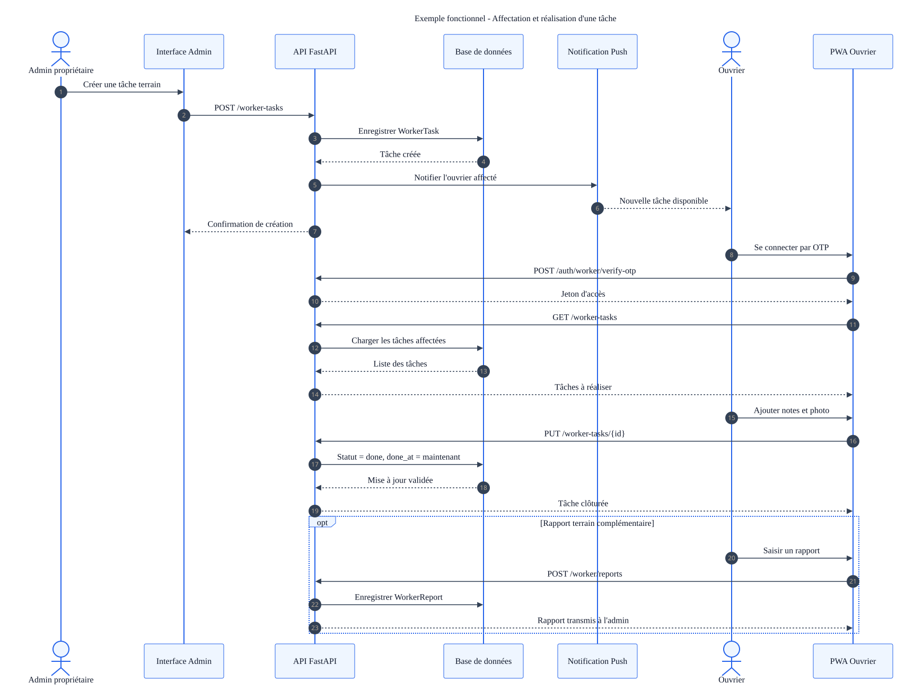

**Légende proposée —** Séquence d'affectation, d'exécution et de validation
d'une tâche terrain.

Le diagramme illustre le cycle de vie d'une tâche depuis sa création par le
propriétaire jusqu'à sa réalisation par l'ouvrier. Les changements d'état
permettent de suivre l'avancement, de conserver les preuves d'exécution et de
signaler les difficultés rencontrées. Cette traçabilité améliore la coordination
des équipes et fournit des données exploitables pour mesurer les délais, la
charge de travail et la qualité des interventions. Le scénario montre également
que la transformation numérique ne se limite pas à automatiser une action :
elle structure la responsabilité et l'historique décisionnel.

## Figure 7 — Chaîne de télémétrie et d'alerte

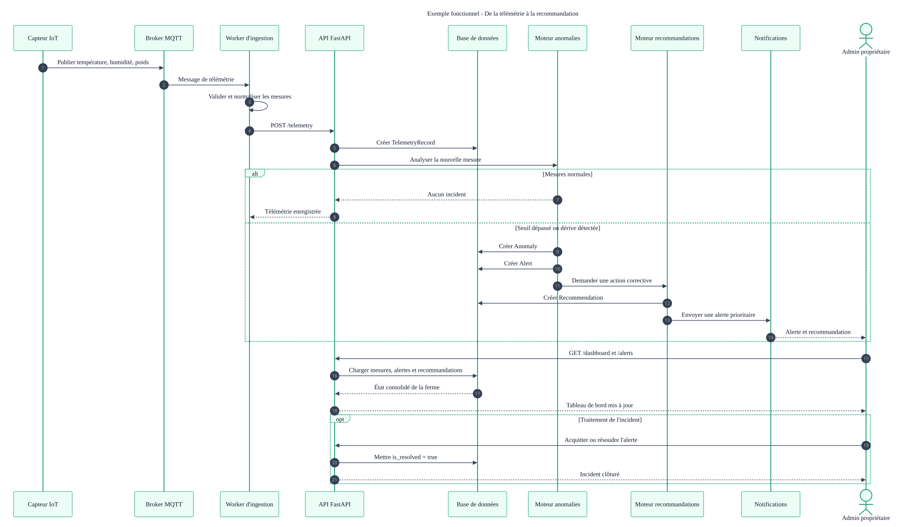

**Légende proposée —** Chaîne fonctionnelle allant de la collecte IoT à la
production d'une recommandation.

Cette figure décrit la transformation d'une mesure brute en information
actionnable. Les données des capteurs sont d'abord validées et historisées,
puis analysées par des règles métier ou des modèles de détection d'anomalies.
Lorsqu'un comportement atypique est identifié, le système génère une alerte
associée à un niveau de gravité et peut proposer une recommandation
contextualisée. Cette architecture sépare correctement la collecte, l'analyse
et la décision, ce qui améliore l'explicabilité et permet de faire évoluer les
algorithmes sans modifier les équipements IoT.

## Figure 8 — Visite apicole

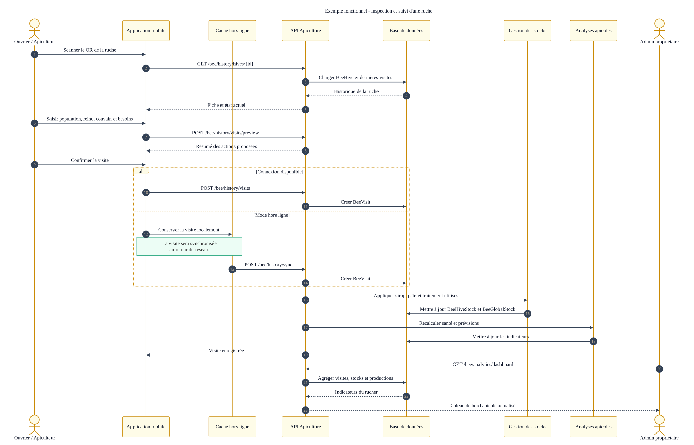

**Légende proposée —** Déroulement d'une inspection de ruche avec collecte
terrain et synchronisation des observations.

Le scénario de visite apicole montre comment l'ouvrier ou l'apiculteur identifie
une ruche, saisit les observations de santé, vérifie la reine, le couvain, la
population et les besoins en ressources. La possibilité de travailler hors
ligne est adaptée aux ruchers situés dans des zones où la connectivité est
limitée. Après synchronisation, les données alimentent l'historique de la ruche,
les stocks et la planification des interventions futures. Ce processus transforme
une inspection souvent informelle en une source de données structurées,
comparables et utilisables pour l'analyse prédictive.

## Figure 9 — Classes utilisateurs, fermes et tâches


**Légende proposée —** Modèle de classes de la gestion des utilisateurs, des
exploitations et du travail opérationnel.

Ce diagramme met en relation les comptes utilisateurs, les fermes, les liens de
propriété, les affectations d'ouvriers et les tâches. Il matérialise la
distinction entre identité, autorisation et rattachement organisationnel, ce
qui permet à un utilisateur d'exercer un rôle différent selon le contexte. Les
associations avec les tâches et les rapports assurent la traçabilité des actions
effectuées sur le terrain. Cette modélisation est particulièrement importante
pour garantir l'isolation des données entre fermes et produire des indicateurs
de performance par équipe.

## Figure 10 — Classes IoT et intelligence artificielle


**Légende proposée —** Modèle de données du pipeline IoT, de la détection
d'anomalies et des recommandations.

Le diagramme structure la chaîne analytique autour des capteurs, des mesures de
télémétrie, des événements de vision, des anomalies, des alertes et des
recommandations. Les mesures brutes demeurent séparées des interprétations
produites par les algorithmes, ce qui préserve la possibilité d'auditer ou de
recalculer une décision. Les contributions de variables et les scores
d'anomalie peuvent être conservés afin d'améliorer l'explicabilité. Cette
architecture soutient ainsi une intelligence artificielle traçable, dans
laquelle chaque recommandation peut être reliée aux données qui l'ont motivée.

## Figure 11 — Classes du module apicole


**Légende proposée —** Modèle de classes du suivi des ruchers, ruches, visites,
productions, stocks et interventions.

Le module apicole repose sur une hiérarchie allant de la ferme au rucher, puis
du rucher à la ruche individuelle. Les visites, productions, dépenses, stocks
et planifications sont historisés afin d'étudier l'évolution de chaque colonie
et la performance de chaque site. Cette granularité permet de relier les
conditions locales, le type floral, les traitements et les récoltes. Le modèle
offre ainsi une base pertinente pour développer des indicateurs de santé, des
prévisions de production et des recommandations adaptées à chaque ruche.

## Figure 12 — Classes du module avicole


**Légende proposée —** Modèle de classes de l'ERP avicole et du contrat de
validation des données.

Cette figure organise la gestion avicole autour du lot de production, auquel
sont rattachés l'alimentation, la ponte, la santé, les ventes et les stocks.
Les journaux métier intègrent un statut de validation, l'auteur de la saisie et
le validateur, ce qui constitue un véritable contrat de qualité des données.
Cette gouvernance est indispensable avant de calculer des indicateurs tels que
le FCR, la mortalité ou le taux de ponte. Le diagramme montre ainsi que la
performance d'un modèle Data Science dépend directement de la fiabilité du
processus de collecte et de validation.

---

# Partie II — Data Science, vision par ordinateur et MLOps

## Figure 13 — Structure du dataset BeeData

**Légende proposée —** Organisation du dataset BeeData et configuration de
l'apprentissage YOLO OBB.

La figure présente la séparation du dataset apicole en ensembles
d'entraînement, de validation et de test ainsi que les quatre classes étudiées :
abeille, faux-bourdon, abeille porteuse de pollen et reine. Le recours à des
boîtes englobantes orientées est pertinent, car la position angulaire des
abeilles varie fortement dans les images. Cette organisation permet de
distinguer l'optimisation du modèle de son évaluation finale sur des données
non utilisées pendant l'apprentissage. Les effectifs par classe ne sont pas
affichés, car les images brutes référencées sur Kaggle ne sont pas disponibles
localement ; cette absence évite de présenter des statistiques non vérifiées.

## Figure 14 — Prédictions qualitatives sur les abeilles

**Légende proposée —** Exemples de détections produites par le modèle YOLO OBB
sur des images apicoles.

Cette planche permet d'évaluer qualitativement la capacité du modèle à localiser
plusieurs abeilles et à représenter leur orientation. Elle complète les
métriques numériques en révélant des aspects difficilement résumables par une
moyenne, tels que les objets partiellement masqués, les scènes denses et la
qualité géométrique des boîtes. Une inspection visuelle reste indispensable
pour détecter les faux positifs systématiques ou les objets non reconnus. Ces
exemples doivent toutefois être considérés comme illustratifs et non comme une
preuve suffisante de généralisation à toutes les conditions de terrain.

## Figure 15 — Courbes d'entraînement du modèle apicole

**Légende proposée —** Évolution des pertes, de la précision, du rappel et de
la mAP pendant l'entraînement du modèle apicole.

Les courbes permettent d'étudier simultanément la convergence de l'optimisation
et l'amélioration de la capacité de détection. La diminution des pertes
d'entraînement doit être interprétée avec les pertes de validation afin de
repérer un éventuel surapprentissage. L'évolution de la précision, du rappel et
de la mAP montre si les gains numériques se traduisent réellement par une
meilleure localisation des objets. La stabilisation en fin d'apprentissage
justifie la sélection des poids associés à la meilleure époque plutôt que
l'utilisation automatique de la dernière époque.

## Figure 16 — Synthèse des performances du modèle apicole

**Légende proposée —** Synthèse quantitative des performances observées à la
meilleure époque du modèle apicole.

Le modèle atteint une précision de 0,809, un rappel de 0,748, une mAP@0.50 de
0,816 et une mAP@0.50:0.95 de 0,630. L'écart entre les deux niveaux de mAP
indique que le modèle identifie correctement une grande partie des objets,
mais que la précision géométrique diminue lorsque le critère de recouvrement
devient plus strict. La combinaison d'une précision supérieure au rappel
signale également que les détections produites sont relativement fiables,
alors que certains objets restent non détectés. Ces résultats sont
encourageants, mais doivent être confirmés sur des images issues du rucher réel.

## Figure 17 — Analyse exploratoire de la télémétrie apicole

**Légende proposée —** Analyse exploratoire des séries temporelles et des
relations entre les variables apicoles.

Cette figure synthétise les distributions, les évolutions temporelles et les
corrélations de 2 000 observations portant sur la température, l'humidité, le
poids de la ruche et le niveau sonore. L'analyse exploratoire permet
d'identifier les tendances, la variabilité et les dépendances qui peuvent
influencer la modélisation. Elle sert également à détecter les problèmes
d'échelle, les valeurs atypiques et les variables redondantes. Cette étape
précède nécessairement toute prévision ou détection d'anomalies, car la qualité
d'un modèle dépend de la compréhension statistique des données d'entrée.

## Figure 18 — Détection d'anomalies de télémétrie

**Légende proposée —** Identification non supervisée des observations atypiques
dans la télémétrie apicole.

La figure associe les scores d'Isolation Forest à une projection PCA afin de
visualiser les observations considérées comme inhabituelles. Cette approche est
adaptée à un contexte où les anomalies ne disposent pas toujours d'étiquettes
fiables. Les contributions des variables aident à déterminer si l'alerte est
principalement liée à la température, à l'humidité, au poids ou au niveau
sonore. Une anomalie statistique ne constitue cependant pas automatiquement un
problème biologique ; elle doit être confrontée au contexte saisonnier et
validée par l'apiculteur.

## Figure 19 — Pipeline MLOps et active learning

**Légende proposée —** Cycle de vie des données et des modèles, de
l'acquisition au réentraînement.

Le pipeline présente une chaîne reproductible intégrant la collecte, le
contrôle qualité, le versionnement DVC, l'entraînement, l'évaluation, le suivi
MLflow, le déploiement et la surveillance de dérive. Les corrections humaines
et les exemples difficiles alimentent une boucle d'active learning permettant
d'améliorer progressivement les datasets. Cette organisation limite le risque
de déployer un modèle dont les données, les paramètres ou les performances ne
sont pas traçables. Elle fait passer le projet d'une expérimentation ponctuelle
à un processus d'industrialisation où chaque version peut être auditée,
comparée et, si nécessaire, restaurée.

## Figure 20 — Fiche du modèle poulet

**Légende proposée —** Courbes d'entraînement, performances par classe et
hyperparamètres du modèle de détection des maladies du poulet.

La fiche montre une meilleure mAP@0.50 de 0,513 et une mAP@0.50:0.95 de 0,240,
avec des performances très variables entre les six classes. Les faibles
résultats de certaines pathologies peuvent provenir d'un déséquilibre du
dataset, d'une forte similarité visuelle ou d'annotations insuffisamment
homogènes. L'écart entre les performances d'entraînement et de validation doit
être surveillé pour détecter un éventuel manque de généralisation. Une
augmentation ciblée des classes rares et une validation vétérinaire des
annotations constituent les améliorations prioritaires.

## Figure 21 — Fiche du modèle chèvre

**Légende proposée —** Évaluation du modèle YOLOv11 de détection des maladies
cutanées de la chèvre.

Le modèle atteint une précision de 0,640, un rappel de 0,613 et une
mAP@0.50:0.95 de 0,261. La performance par classe montre que les maladies
présentant des signes visuels distinctifs sont mieux reconnues que les
affections rares ou proches sur le plan dermatologique. Ces résultats
caractérisent un prototype fonctionnel, mais encore insuffisant pour produire
un diagnostic autonome. Le système doit donc présenter la détection comme une
aide au dépistage et orienter l'utilisateur vers une validation vétérinaire.

## Figure 22 — Fiche du modèle citronnier

**Légende proposée —** Courbes d'apprentissage et matrice de confusion du
modèle de détection des maladies du citronnier.

Le modèle citronnier présente les meilleures performances du groupe étudié,
avec une précision de 0,959 et une mAP@0.50:0.95 de 0,801. La diagonale
dominante de la matrice de confusion traduit une séparation satisfaisante des
neuf classes. Les erreurs résiduelles concernent principalement l'arrière-plan
et certaines maladies possédant des symptômes proches. Malgré ces résultats
élevés, une évaluation sur des parcelles, appareils et conditions lumineuses
différents reste nécessaire pour mesurer la robustesse hors du dataset initial.

## Figure 23 — Fiche du modèle oranger

**Légende proposée —** Synthèse de l'entraînement et de l'évaluation du modèle
de maladies des feuilles d'oranger.

Le modèle obtient une mAP@0.50 de 0,572 et une mAP@0.50:0.95 de 0,423. Cet
écart montre que les catégories sont partiellement reconnues, mais que la
localisation précise demeure plus difficile. La faible taille ou diversité du
dataset, ainsi que les variations d'apparence des symptômes, peuvent expliquer
cette limitation. L'amélioration doit associer enrichissement des données,
contrôle des annotations, augmentation adaptée et analyse systématique des
confusions entre classes.

## Figure 24 — Fiche du modèle insectes

**Légende proposée —** Résultats du modèle YOLOv11 pour la détection de dix
catégories d'insectes ravageurs.

Avec une précision de 0,922, un rappel de 0,800 et une mAP@0.50 de 0,906, le
modèle fournit des résultats globalement solides. Le rappel inférieur à la
précision indique néanmoins qu'une partie des insectes n'est pas détectée,
notamment lorsqu'ils sont petits, peu contrastés ou partiellement occultés.
La matrice de confusion permet de localiser les classes les plus sensibles à
l'arrière-plan ou aux ressemblances morphologiques. Pour une utilisation en
protection des cultures, le seuil de confiance devra être calibré en fonction
du coût relatif des faux positifs et des ravageurs manqués.

## Figure 25 — Comparaison des modèles YOLOv11

**Légende proposée —** Comparaison des performances et des principaux
hyperparamètres des modèles de vision agricole.

La comparaison met en évidence une forte hétérogénéité des performances selon
le domaine. Les modèles citronnier et insectes se distinguent, tandis que les
modèles poulet et chèvre restent plus limités selon la métrique stricte
mAP@0.50:0.95. Comme l'architecture et plusieurs hyperparamètres sont proches,
les écarts observés sont probablement liés à la difficulté intrinsèque du
problème, à la qualité des annotations et à la représentativité des datasets.
Il convient toutefois d'éviter un classement absolu, car les modèles ne sont
pas évalués sur le même nombre de classes ni sur les mêmes images.

---

# Partie III — RAG, LLM et étude Data Science

## Figure 26 — Architecture RAG et LLM multimodale

**Légende proposée —** Architecture multimodale combinant données métier,
documents, vision, retrieval et génération.

Cette architecture associe la question de l'utilisateur aux données SQL de la
ferme, aux images du terrain et à une base de connaissances agronomiques. La
recherche hybride mobilise ChromaDB lorsque le service vectoriel est disponible
et conserve une recherche lexicale de secours en mode Lite. Les passages
récupérés, les observations visuelles et le contexte métier alimentent ensuite
un prompt spécialisé avant la génération par Groq ou Ollama. La séparation
entre compréhension, retrieval, génération et sortie facilite l'audit du
système et réduit le risque qu'une réponse soit produite sans contexte
documentaire pertinent.

## Figure 27 — Pipeline d'ingestion multisource

**Légende proposée —** Processus recommandé pour intégrer des documents et des
bases externes dans le système RAG.

Le pipeline couvre l'import de PDF, DOCX, TXT, CSV, Excel, JSON et exports SQL.
Avant toute indexation, les fichiers sont soumis à des contrôles d'autorisation,
de format, de sécurité, d'anonymisation et d'isolation par ferme. Le nettoyage,
le scoring de qualité, le découpage sémantique et l'enrichissement en
métadonnées précèdent la création des embeddings. La publication n'intervient
qu'après évaluation du retrieval, contrôle de la génération et validation par
un agronome ou un vétérinaire, ce qui garantit une gouvernance scientifique des
connaissances ajoutées.

## Figure 28 — Séquence d'une question RAG

**Légende proposée —** Séquence complète de traitement d'une question
multimodale dans l'assistant agricole.

La séquence commence par la réception d'une question, éventuellement
accompagnée d'une image et d'une espèce. Le système enrichit la demande par
l'analyse visuelle, l'OCR et les données autorisées de la ferme, puis interroge
la base documentaire. Le LLM reçoit uniquement le contexte sélectionné et le
prompt spécialisé correspondant au domaine. L'enregistrement des sources, du
contexte et du feedback permet enfin de reconstituer la décision et d'améliorer
le système lors des versions ultérieures.

## Figure 29 — Modèle de données du RAG

**Légende proposée —** Intégration des entités documentaires et des évaluations
RAG avec les données métier.

Le modèle proposé relie les documents et leurs fragments aux fermes, aux
animaux, aux ruches et aux historiques de diagnostic. La distinction entre
`KnowledgeDocument` et `KnowledgeChunk` permet de conserver à la fois la
provenance globale et les unités effectivement indexées dans la base
vectorielle. Les checksums et versions assurent la détection des doublons et la
reproductibilité du corpus. L'entité d'évaluation rend possible le suivi des
performances de chaque version avant sa publication.

## Figure 30 — Protocole d'évaluation du RAG

**Légende proposée —** Protocole multicritère d'évaluation du retrieval, de la
génération et de l'utilité opérationnelle.

L'évaluation sépare explicitement la qualité de la recherche documentaire de
la qualité de la réponse générée. Recall@k, MRR et nDCG mesurent la capacité à
retrouver les sources pertinentes, tandis que la faithfulness, la pertinence et
l'exactitude des citations évaluent le LLM. La validation par des experts et
des utilisateurs complète les métriques automatiques en mesurant la correction,
la clarté et l'actionnabilité. Le suivi de la latence, du coût, du taux no-hit
et de la dérive permet ensuite d'évaluer le comportement réel du système en
production.

## Figure 31 — Couverture de la base de connaissances

**Légende proposée —** Profil statistique du corpus agronomique utilisé par le
RAG.

Le corpus contient 23 passages couvrant 13 espèces ou domaines et 179 mots-clés.
Les animaux et les plantes sont les catégories les plus représentées, alors
que plusieurs espèces ne disposent que d'un seul document. La longueur moyenne
d'environ 309 caractères correspond à des conseils courts, adaptés à une
recherche ciblée mais insuffisants pour couvrir des protocoles complexes. Cette
analyse montre que le corpus constitue un noyau cohérent de démonstration,
mais qu'un enrichissement versionné et validé est nécessaire avant une
utilisation experte à grande échelle.

## Figure 32 — Profil de la base métier

**Légende proposée —** Volumétrie et distribution des principales données
opérationnelles de Smart Farm AI.

La base contient notamment 151 événements de vision, 154 alertes, 88 journaux
avicoles et dix unités animales. Les scores de santé sont fortement concentrés
vers les valeurs élevées, ce qui peut refléter une population saine mais aussi
une faible diversité des états enregistrés. La confiance moyenne des événements
CV est de 0,527 et plusieurs indicateurs avicoles présentent des valeurs
atypiques. Le profil confirme que la base est exploitable pour une étude
exploratoire, mais que sa taille et sa concentration thématique limitent encore
la portée des modèles prédictifs.

## Figure 33 — Audit de qualité et disponibilité

**Légende proposée —** Synthèse des défauts de qualité et des données absentes
dans la base opérationnelle.

L'audit identifie 88 journaux avicoles en attente de validation, 35 poids moyens
manquants, cinq FCR supérieurs à trois et plusieurs champs apicoles non
renseignés. Il révèle également l'absence totale de données dans six tables
critiques, notamment la télémétrie, les anomalies, les recommandations et les
évaluations de modèles. Ces lacunes empêchent de valider correctement certaines
briques pourtant présentes dans le code. La priorité méthodologique consiste
donc à améliorer les contrats de données et la collecte avant d'augmenter la
complexité des algorithmes.

## Figure 34 — Benchmark du retrieval lexical

**Légende proposée —** Évaluation contrôlée du fallback lexical sur un jeu de
22 questions agronomiques.

Le benchmark obtient un Top-1 de 95,5 %, un Top-3 de 100 % et un MRR de 0,977.
Ces résultats montrent que les mots-clés et le filtre d'espèce retrouvent
efficacement les passages attendus dans le corpus actuel. Ils ne doivent
cependant pas être interprétés comme une performance en production, car les
questions sont peu nombreuses et étroitement liées aux documents existants.
Une évaluation robuste doit inclure des paraphrases, des requêtes hors domaine,
des formulations en derja, des questions contradictoires et une comparaison
avec la recherche vectorielle.

## Figure 35 — Matrice de maturité Data Science

**Légende proposée —** Évaluation qualitative de la maturité des capacités Data
Science selon les domaines fonctionnels.

La matrice montre que la vision par ordinateur, l'analyse exploratoire et
plusieurs services métier sont déjà implémentés, tandis que certaines fonctions
de prévision, d'explicabilité et de gouvernance restent au niveau prototype.
Le domaine avicole présente une chaîne analytique relativement complète, alors
que les plantes et les arbres manquent encore de données relationnelles et de
séries temporelles structurées. Le RAG est opérationnel pour la recherche et la
génération, mais son évaluation scientifique et son MLOps doivent être
renforcés. Cette lecture fournit une feuille de route pragmatique : prioriser la
qualité et la collecte des données avant d'industrialiser les composants les
moins matures.

---

# Recommandations d'intégration

Dans le corps du rapport, chaque paragraphe peut être placé immédiatement après
la figure correspondante. La légende doit rester concise et descriptive, tandis
que le paragraphe doit expliquer la signification de la figure, son apport au
projet et ses limites. Pour les figures de résultats, il est recommandé de
conserver les valeurs numériques observées et d'éviter toute généralisation à
des données non testées. Pour les diagrammes d'architecture cible, le texte doit
indiquer explicitement qu'il s'agit d'une recommandation lorsque les composants
ne sont pas encore entièrement implémentés.
