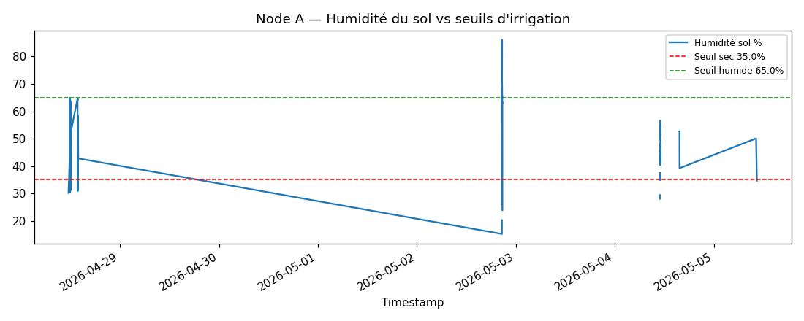

# Smart Farm AI — Étude Data Science (IoT Telemetry)

- Enregistrements : **1477**
- Période : **2026-04-28 11:29:46 → 2026-05-05 10:36:33**
- Nœuds : ['Node A', 'Node B']
- Métriques : ['brood_temp', 'ext_hum', 'ext_temp', 'fault', 'flow', 'hive_temp', 'hive_weight', 'pressure', 'pump', 'soil', 'soil_temp', 'temp', 'valve', 'weight']

## 1. Qualité des données

- Doublons : 0
- Valeurs manquantes (après parse) : 0

```
node    metric     
Node A  fault           98
        flow           187
        pressure       187
        pump            99
        soil           188
        soil_temp       88
        temp            99
        valve           99
Node B  brood_temp      87
        ext_hum        108
        ext_temp       108
        hive_temp       21
        hive_weight     87
        weight          21
```

## 2. Statistiques descriptives par métrique


```
             count   mean    std    min  median     max
metric                                                 
brood_temp      87  34.85   0.50  34.00   34.90   35.80
ext_hum        108  54.32   9.63  40.00   54.40   70.00
ext_temp       108  28.20   9.93  13.70   26.40   80.00
fault           98   1.00   0.00   1.00    1.00    1.00
flow           187  13.31   5.38   0.80   13.16   25.00
hive_temp       21  31.81  30.98  22.00   22.00  125.00
hive_weight     87  44.87   1.81  42.00   44.80   48.00
pressure       187   3.12   2.57   0.20    3.87    8.22
pump            99   0.00   0.00   0.00    0.00    0.00
soil           188  46.79  10.74  15.24   46.21   85.98
soil_temp       88  23.64   1.87  20.00   23.50   26.80
temp            99  22.00   0.00  22.00   22.00   22.00
valve           99   0.00   0.00   0.00    0.00    0.00
weight          21  23.32  12.21   3.58   19.79   42.17
```

## 3. Séries temporelles



## 4. Corrélations (Pearson)


**Node A**

```
metric     fault  flow  pressure  pump  soil  soil_temp  temp  valve
metric                                                              
fault        NaN   NaN       NaN   NaN   NaN        NaN   NaN    NaN
flow         NaN  1.00     -0.12   NaN  0.17       0.04   NaN    NaN
pressure     NaN -0.12      1.00   NaN  0.00      -0.06   NaN    NaN
pump         NaN   NaN       NaN   NaN   NaN        NaN   NaN    NaN
soil         NaN  0.17      0.00   NaN  1.00      -0.08   NaN    NaN
soil_temp    NaN  0.04     -0.06   NaN -0.08       1.00   NaN    NaN
temp         NaN   NaN       NaN   NaN   NaN        NaN   NaN    NaN
valve        NaN   NaN       NaN   NaN   NaN        NaN   NaN    NaN
```

**Node B**

```
metric       brood_temp  ext_hum  ext_temp  hive_temp  hive_weight  weight
metric                                                                    
brood_temp         1.00     0.16      0.03        NaN        -0.00     NaN
ext_hum            0.16     1.00     -0.21        NaN        -0.03     NaN
ext_temp           0.03    -0.21      1.00      -0.21        -0.06   -0.65
hive_temp           NaN      NaN     -0.21       1.00          NaN    0.36
hive_weight       -0.00    -0.03     -0.06        NaN         1.00     NaN
weight              NaN      NaN     -0.65       0.36          NaN    1.00
```

## 5. Détection d'anomalies (IsolationForest)

- Node A : trop peu de points complets (0) pour l'IsolationForest
- Node B : trop peu de points complets (0) pour l'IsolationForest

## 6. Insights métier

- Sol sous le seuil sec (35.0%) : **11.2%** du temps → besoin d'irrigation
- Sol au-dessus du seuil humide (65.0%) : **2.0%** du temps
- Pompe active : 0.0% du temps
- Temp. couvain hors plage saine [32.0-36.0°C] : **0.0%** du temps
- Variation poids ruche : 46.8 → 43.0 kg (Δ -3.8 kg)

## 7. Conclusion

Le pipeline (EDA → séries temporelles → corrélations → anomalies → insights métier FAO-56) montre que les données IoT sont exploitables pour piloter l'irrigation par seuils et surveiller la santé du rucher. Les anomalies détectées alimentent le modèle de production (IsolationForest) et la détection de drift PSI du scheduler.