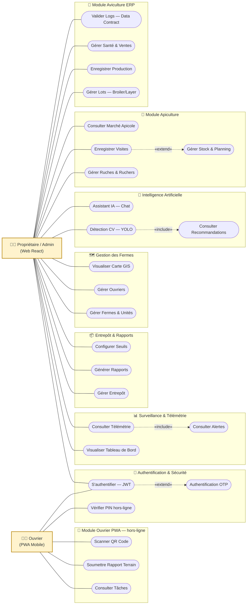
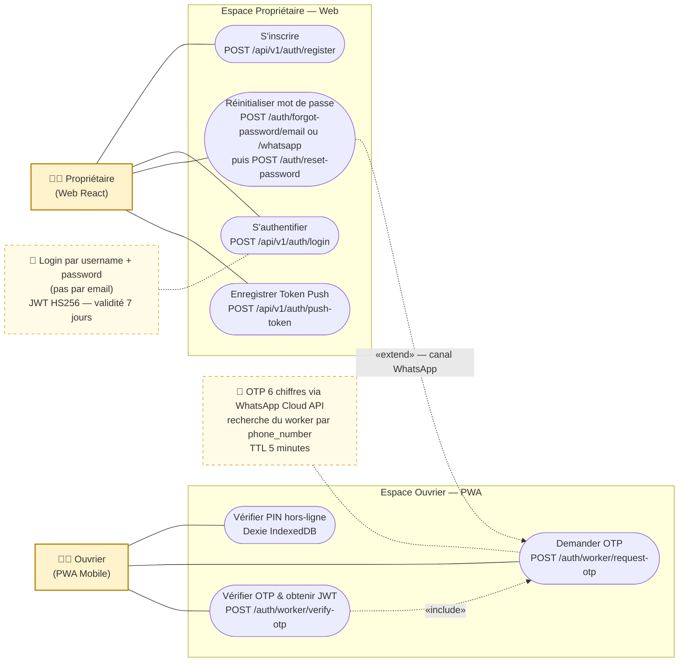
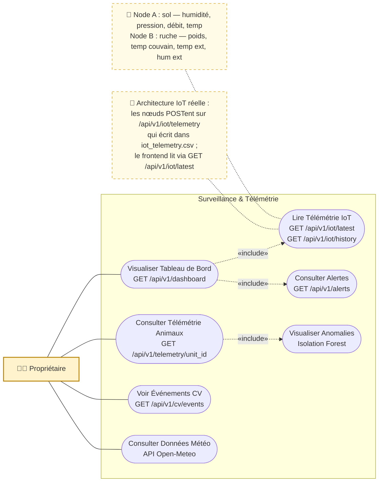
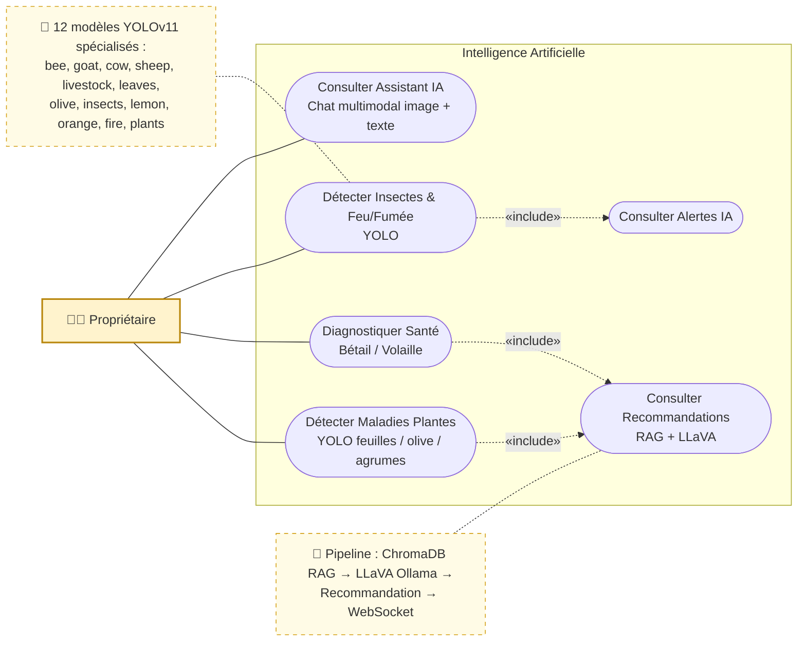
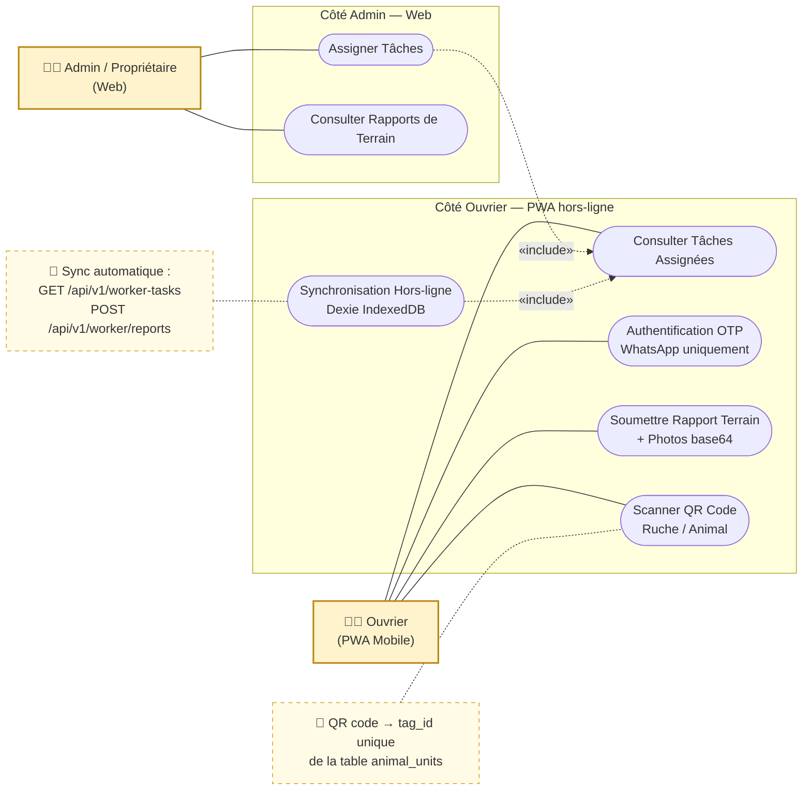
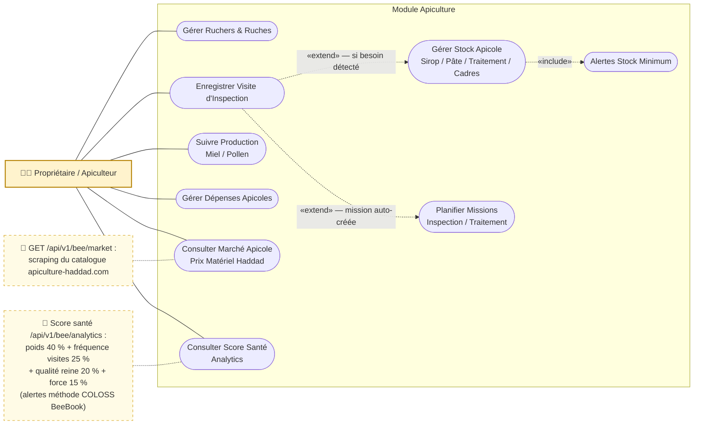
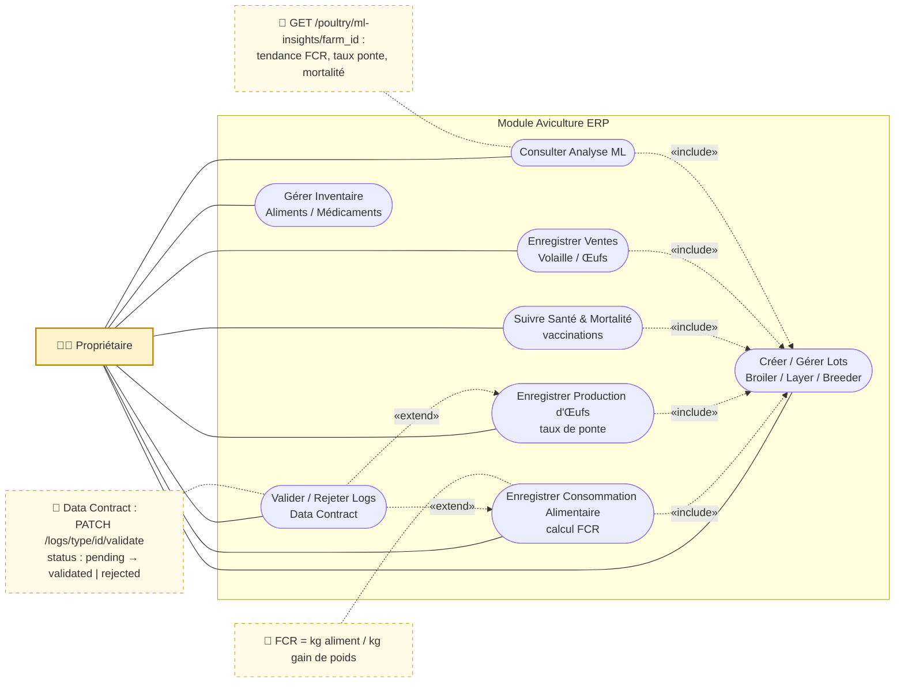

# Diagrammes de Cas d'Utilisation — Smart Farm AI v3.0

> Versions Mermaid des 7 diagrammes UC du rapport (`figures/UC_*.png`).
> Acteurs : **Propriétaire/Admin** (web React) et **Ouvrier** (PWA mobile hors-ligne).
> Conventions : flèches pointillées = relations `«include»` / `«extend»`.

---

## UC-0 — Diagramme de cas d'utilisation global
*Figure source : `UC_Global.png` — 8 sous-systèmes, 21+ cas d'utilisation*

---

## UC-1 — Détail : Authentification & Sécurité
*Figure source : `UC_Detail_Auth.png` — endpoints réels de `auth_routes.py`*

---

## UC-2 — Détail : Surveillance & Télémétrie
*Figure source : `UC_Detail_Surveillance.png` — endpoints réels*

---

## UC-3 — Détail : Intelligence Artificielle
*Figure source : `UC_Detail_IA.png`*

---

## UC-4 — Détail : Module Ouvrier (PWA)
*Figure source : `UC_Detail_Ouvrier.png`*

---

## UC-5 — Détail : Module Apiculture
*Figure source : `UC_Detail_Bee.png`*

---

## UC-6 — Détail : Module Aviculture ERP
*Figure source : `UC_Detail_Poultry.png`*

