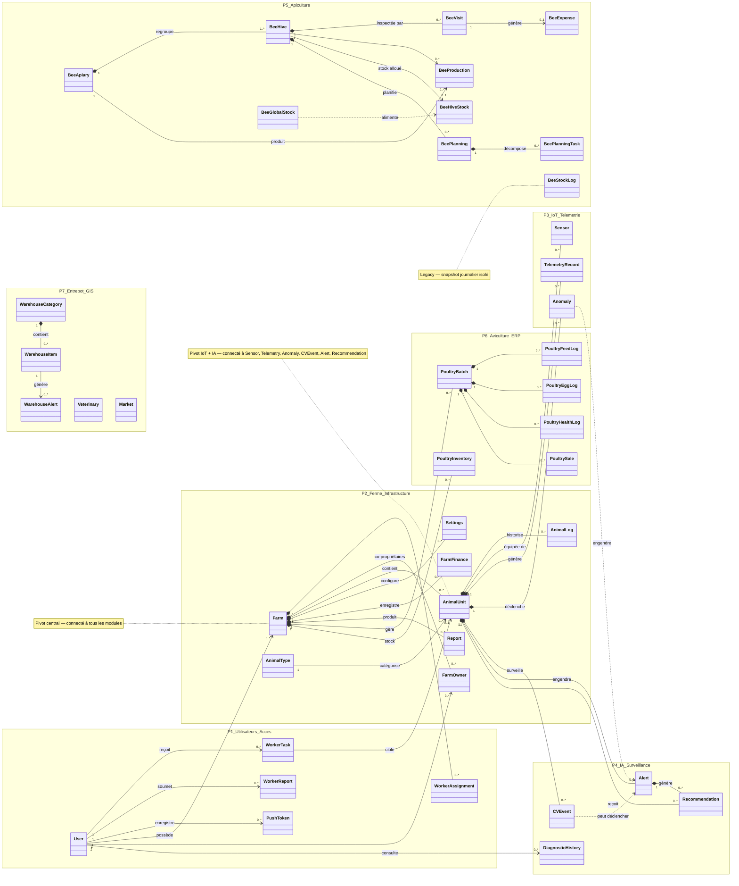
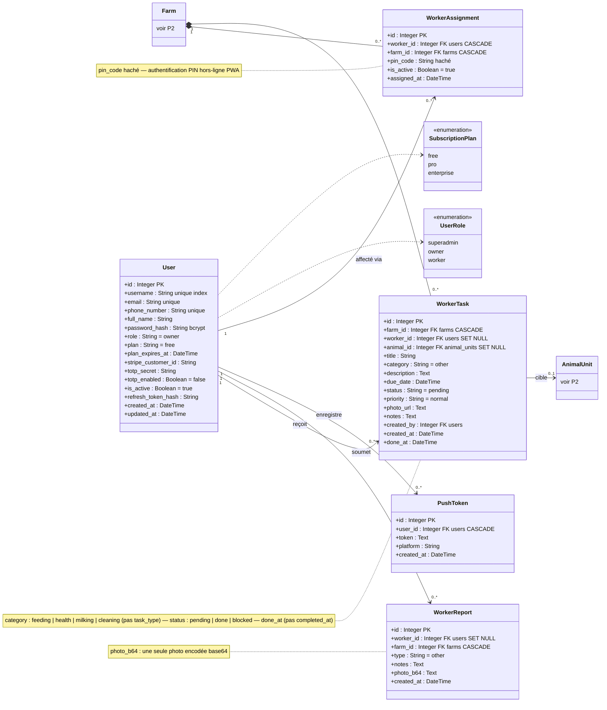
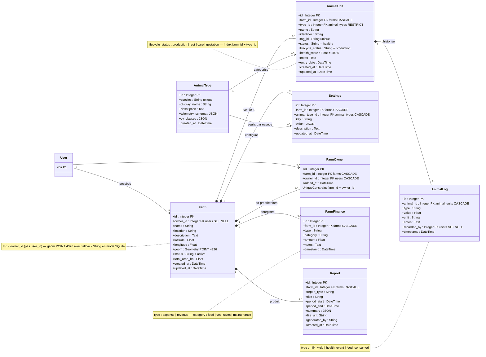
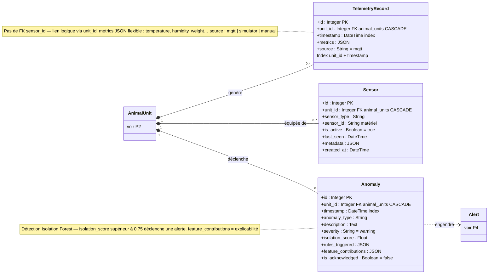
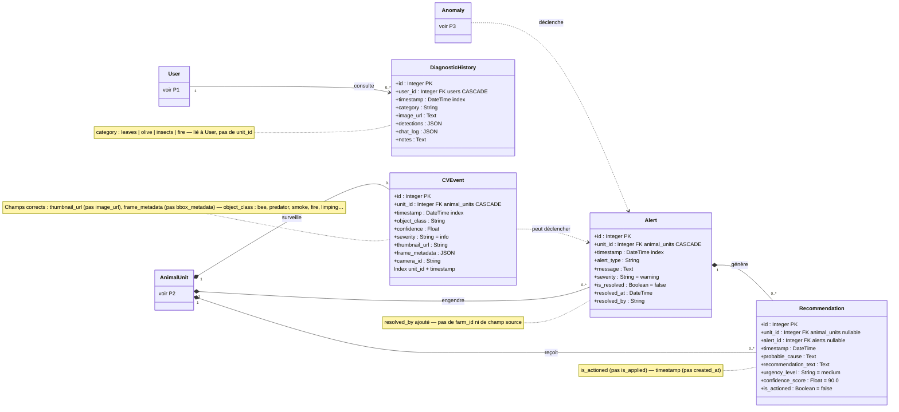
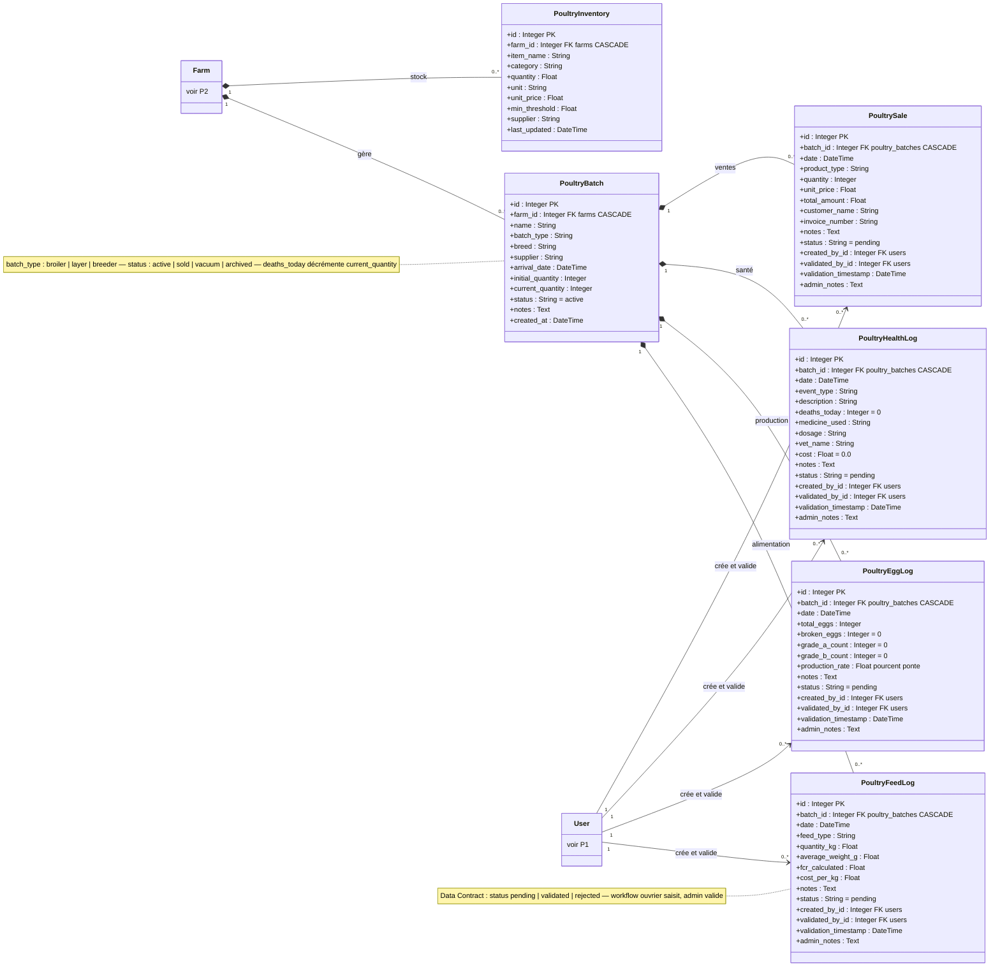
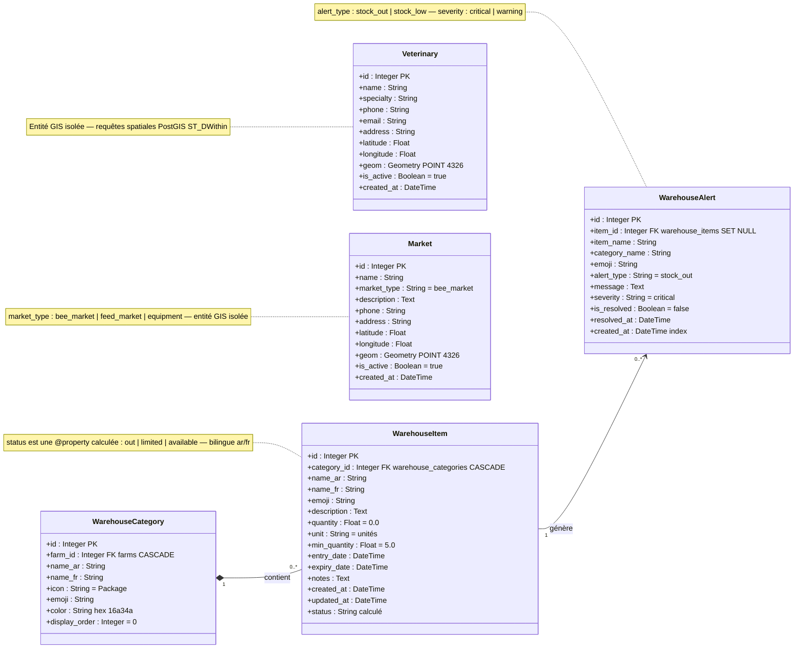

# Diagrammes de Classes — Smart Farm AI v3.0

> Versions Mermaid des 8 diagrammes de classes du rapport (`figures/P0..P7_*.png`).
> Source de vérité : `backend/app/models/domain.py` (38 classes SQLAlchemy, 7 packages).
> Légende : `*--` composition (cascade delete) · `--` association · `..>` dépendance.

---

## P0 — Vue d'Ensemble (38 classes, 7 packages)
*Figure source : `P0_Vue_Ensemble.png` — diagramme simplifié sans attributs*

---

## P1 — Utilisateurs & Contrôle d'Accès
*Figure source : `P1_Utilisateurs.png`*

---

## P2 — Ferme & Infrastructure
*Figure source : `P2_Ferme_Infrastructure.png`*

---

## P3 — IoT & Télémétrie
*Figure source : `P3_IoT_Telemetrie.png`*

---

## P4 — IA & Surveillance
*Figure source : `P4_IA_Surveillance.png`*

---

## P5 — Module Apiculture
*Figure source : `P5_Apiculture.png`*

```mermaid
classDiagram
    direction LR

    class BeeApiary {
        +id : Integer PK
        +farm_id : Integer FK farms CASCADE
        +name : String
        +latitude : Float
        +longitude : Float
        +flower_type : String
        +season : String
        +region : String
        +notes : Text
        +created_at : DateTime
        +updated_at : DateTime
    }

    class BeeHive {
        +id : Integer PK
        +apiary_id : Integer FK bee_apiaries CASCADE
        +identifier : String unique HIVE-0001
        +is_active : Boolean = true
        +health_score : Float = 10.0
        +honey_level : Float = 5.0
        +force_level : Float = 5.0
        +hive_type : String
        +queen_year : Integer
        +has_queen : Boolean = true
        +queen_count : Integer = 0
        +last_visit_date : DateTime
        +notes : Text
        +created_at : DateTime
        +updated_at : DateTime
    }

    class BeeVisit {
        +id : Integer PK
        +hive_id : Integer FK bee_hives CASCADE
        +apiary_id : Integer FK bee_apiaries CASCADE
        +visit_date : String format fr-FR
        +visit_name : String
        +gps_coords : String
        +health_state : String = health
        +health_score : Float
        +force_level : Float
        +temperature : Float
        +honey_level : String = Moyen
        +type_ruche : String
        +reine : Boolean
        +oeufs : Boolean
        +couvain : Boolean
        +population : String
        +pollen_level : String
        +nb_cadres : String
        +needs_sirop : Float = 0
        +needs_pate : Float = 0
        +needs_traitement : Float = 0
        +harvest_kg : Float = 0
        +pollen_kg : Float = 0
        +notes : Text
        +photo_url : Text
        +visited_by : String
        +visitor_role : String
        +created_at : DateTime
    }

    class BeeProduction {
        +id : Integer PK
        +hive_id : Integer FK bee_hives SET NULL
        +apiary_id : Integer FK bee_apiaries CASCADE
        +flower_type : String
        +production_date : String
        +honey_kg : Float = 0.0
        +pollen_kg : Float = 0.0
        +quality_notes : Text
        +created_at : DateTime
    }

    class BeeGlobalStock {
        +id : Integer PK
        +farm_id : Integer FK farms unique
        +sirop : Float litres
        +pate : Float kg
        +traitement : Integer doses
        +cadres : Integer
        +hausse : Integer
        +equipement : Integer
        +sirop_min : Float = 50
        +pate_min : Float = 20
        +traitement_min : Integer = 10
        +cadres_min : Integer = 20
        +updated_at : DateTime
    }

    class BeeHiveStock {
        +id : Integer PK
        +hive_id : Integer FK bee_hives unique
        +sirop : Float
        +pate : Float
        +traitement : Integer
        +cadres : Integer
        +sirop_min : Float = 2
        +pate_min : Float = 1
        +traitement_min : Integer = 1
        +updated_at : DateTime
    }

    class BeeExpense {
        +id : Integer PK
        +hive_id : Integer FK bee_hives SET NULL
        +apiary_id : Integer FK bee_apiaries SET NULL
        +visit_id : Integer FK bee_visits SET NULL
        +expense_date : String
        +amount : Float réel
        +amount_planned : Float prévisionnel
        +category : String
        +description : Text
        +created_at : DateTime
    }

    class BeePlanning {
        +id : Integer PK
        +hive_id : Integer FK bee_hives CASCADE
        +apiary_id : Integer FK bee_apiaries CASCADE
        +scheduled_date : String
        +status : String = pending
        +action_type : String
        +notes : Text
        +predicted_sirop : Float = 0
        +predicted_pate : Float = 0
        +predicted_traitement : Integer = 0
        +predicted_cadres : Integer = 0
        +created_at : DateTime
    }

    class BeePlanningTask {
        +id : Integer PK
        +planning_id : Integer FK bee_planning CASCADE
        +text : String
        +status : String = todo
        +created_at : DateTime
    }

    class BeeStockLog {
        +id : Integer PK
        +log_date : String
        +sirop : Float
        +pate : Float
        +traitement : Float
        +cadres : Integer
        +hausse : Integer
        +equipement : Integer
        +created_at : DateTime
    }

    BeeApiary "1" *-- "1..*" BeeHive : regroupe
    BeeHive "1" *-- "0..*" BeeVisit : inspectée par
    BeeApiary "1" --> "0..*" BeeVisit
    BeeApiary "1" *-- "0..*" BeeProduction : produit
    BeeHive "1" --> "0..*" BeeProduction
    BeeHive "1" --> "0..1" BeeHiveStock : stock alloué
    BeeGlobalStock ..> BeeHiveStock : alimente
    BeeVisit "1" --> "0..1" BeeExpense : génère
    BeeHive "1" --> "0..*" BeeExpense : dépenses
    BeeApiary "1" --> "0..*" BeeExpense : finance
    BeeHive "1" *-- "0..*" BeePlanning : planifie
    BeePlanning "1" *-- "0..*" BeePlanningTask : décompose

    note for BeeVisit "needs_sirop / needs_pate / needs_traitement = Float (pas Boolean) — visit_date stocké en String format fr-FR — type_ruche : MERE | POUSSIN | VIDE | MORTE"
    note for BeeStockLog "Legacy — snapshot journalier isolé, aucune relation"
    note for BeeGlobalStock "Singleton par ferme (farm_id unique) — seuils d'alerte minimum intégrés"
```

---

## P6 — Module Aviculture ERP
*Figure source : `P6_Aviculture_ERP.png`*

---

## P7 — Entrepôt & Services Géospatiaux
*Figure source : `P7_Entrepot_GIS.png`*

