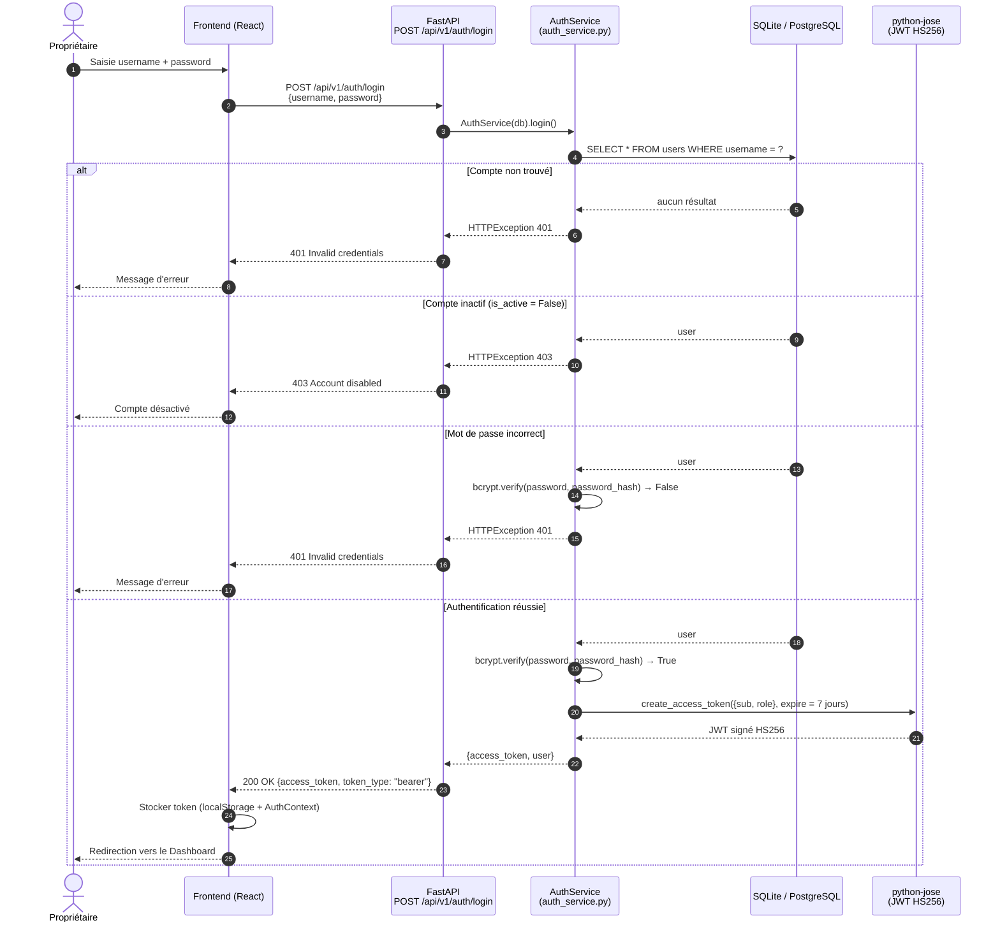
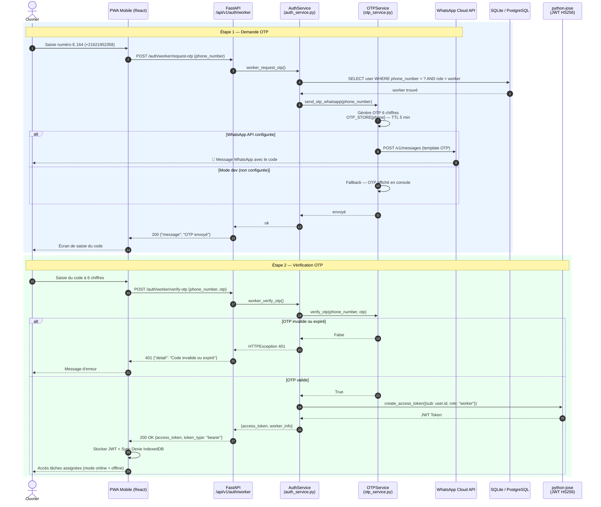
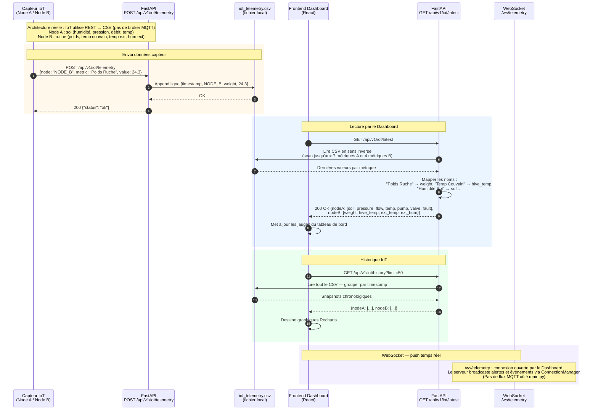
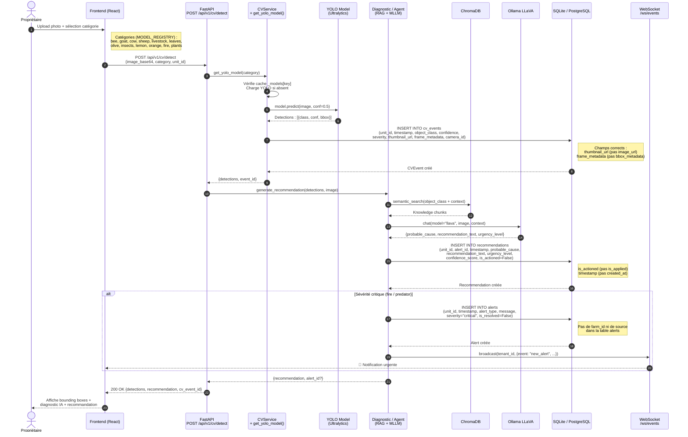
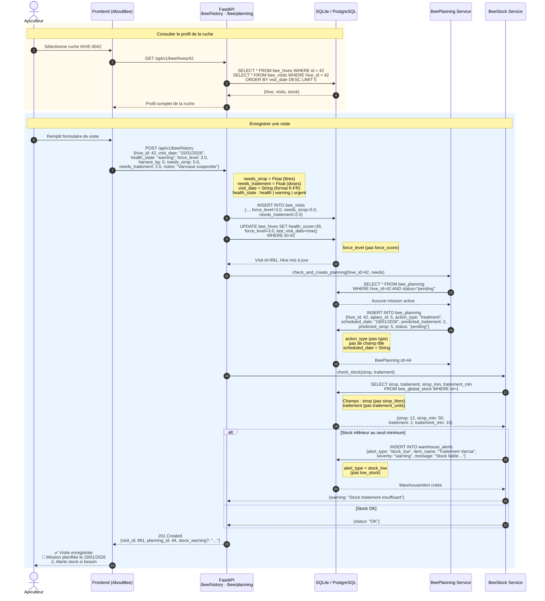

# Diagrammes de Séquence — Smart Farm AI v3.0

> Versions Mermaid des 5 diagrammes de séquence du rapport (`figures/SD1..SD5_*.png`).
> Chaque diagramme reflète le code réel (fichiers sources indiqués).

---

## SD1 — Authentification Propriétaire (JWT)
*Figure source : `SD1_Auth_JWT.png` — Source code : `backend/app/api/v1/endpoints/auth_routes.py`*

---

## SD2 — Authentification Ouvrier (OTP WhatsApp)
*Figure source : `SD2_Ouvrier_OTP.png` — Sources : `auth_service.py` + `otp_service.py`*

---

## SD3 — Pipeline IoT Temps Réel
*Figure source : `SD3_IoT_Telemetrie.png` — Source : `backend/app/main.py` (architecture réelle)*

---

## SD4 — Détection Maladie par Vision par Ordinateur (YOLO)
*Figure source : `SD4_CV_Detection.png` — Source : `backend/app/api/v1/endpoints/cv_routes.py`*

---

## SD5 — Flux Gestion Apicole (Visite → Besoin → Planning → Stock)
*Figure source : `SD5_Bee_Workflow.png` — Sources : `bee_history.py` + `bee_planning.py`*

