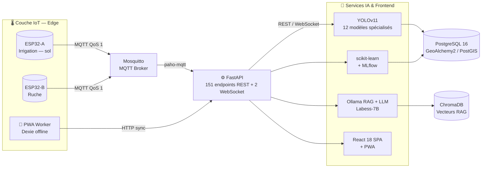
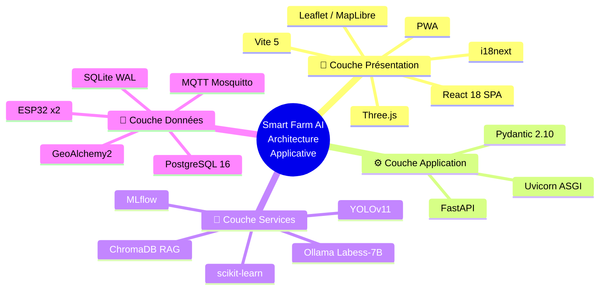
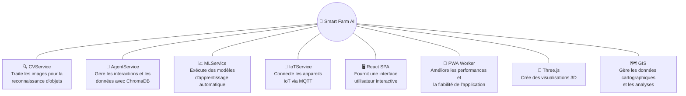
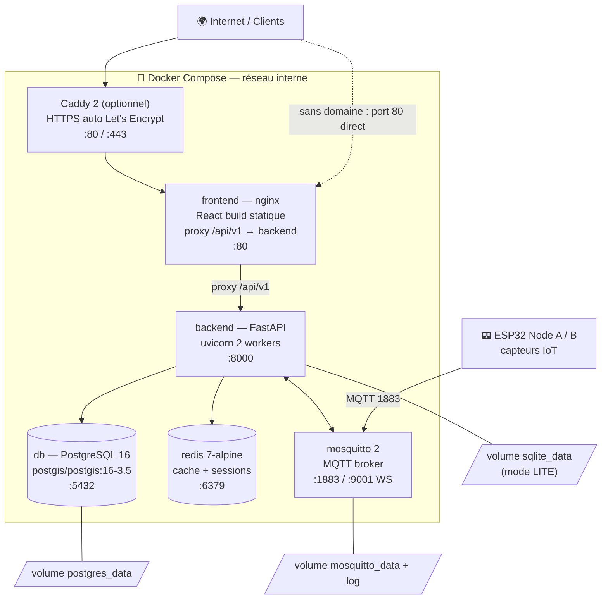
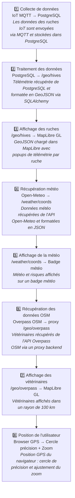

# Diagrammes d'Architecture — Smart Farm AI v3.0

> Versions Mermaid des 5 diagrammes d'architecture du rapport (`figures/architecture_*.png`).
> Note : la figure Napkin originale mentionnait « YOLOv8 11 classes » ; le reste du rapport
> et le code utilisent **YOLOv11 (12 modèles spécialisés)** — c'est la version retenue ici.

---

## A1 — Architecture globale du système
*Figure source : `architecture_smart_farm.png`*

---

## A2 — Architecture applicative en 4 couches
*Figure source : `architecture_applicative_smart_farm.png`*

---

## A3 — Architecture des composants
*Figure source : `architecture_composants_smart_farm.png` — 8 composants*

---

## A4 — Architecture de déploiement Docker
*Figure source : `architecture_deploiement_docker.png` — ancrée sur le `docker-compose.yml` réel*

---

## A5 — Flux de données du module MapCenter
*Figure source : `architecture_flux_donnees_mapcenter.png` — 8 étapes*

