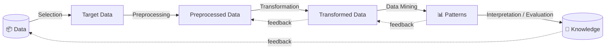
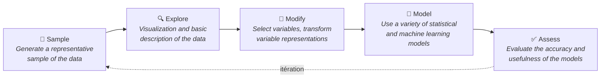
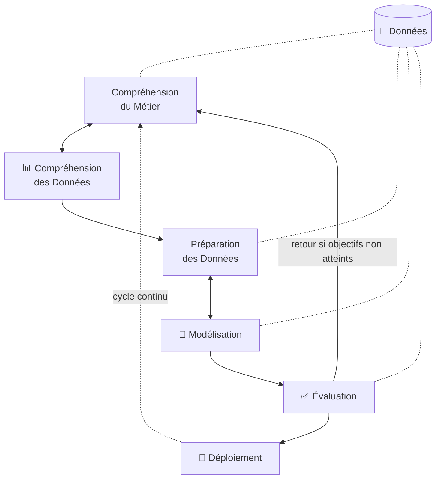
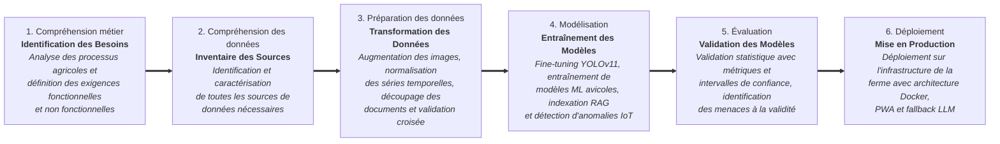
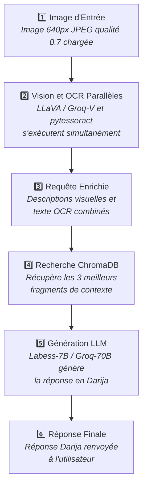
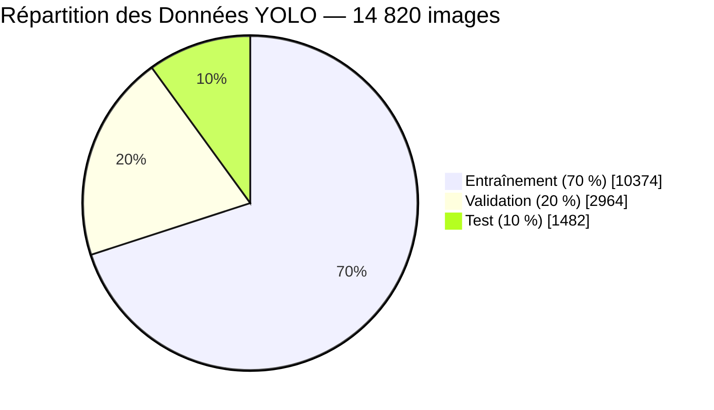
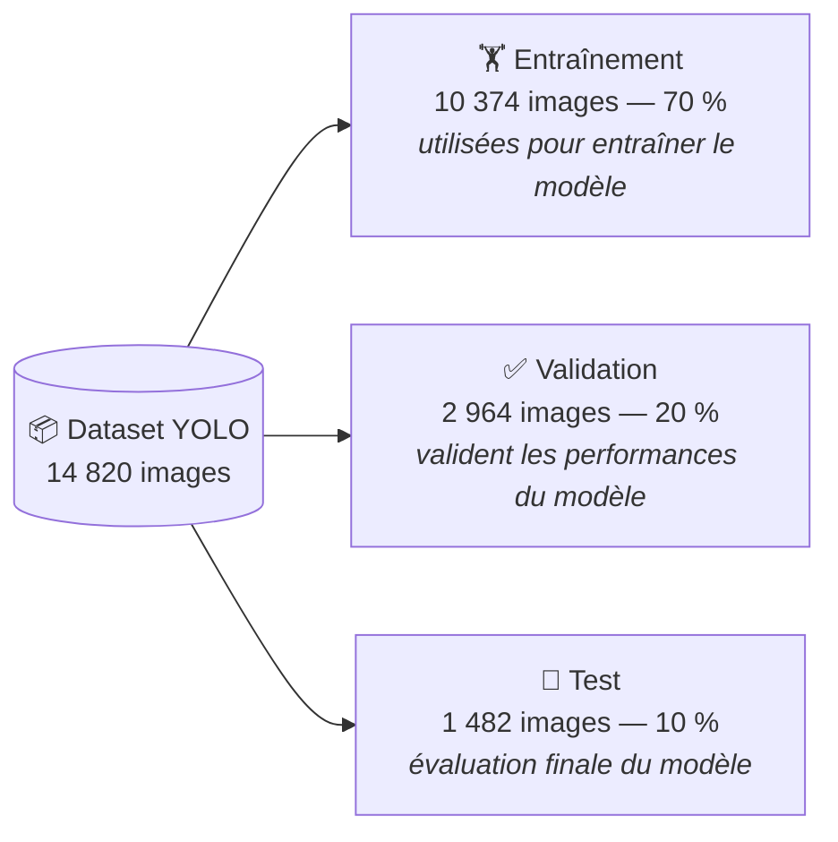

# Diagrammes de Processus & Méthodologie — Smart Farm AI v3.0

> Versions Mermaid des 7 diagrammes de processus du rapport
> (KDD, SEMMA, CRISP-DM, planification projet, pipeline multimodal, entraînement YOLO, répartition des données).

---

## M1 — Processus KDD (Knowledge Discovery in Databases)
*Figure source : `kdd_process.png`*

---

## M2 — Méthodologie SEMMA
*Figure source : `semma_process.png`*

---

## M3 — Cycle CRISP-DM (générique)
*Figure source : `crispdm_process.png`*

---

## M4 — Phases de planification du projet selon CRISP-DM
*Figure source : `phases_planification_smart_farm_crispdm.png`*

---

## M5 — Pipeline multimodal de l'Assistant IA
*Figure source : `pipeline_multimodal_assistant_smart_farm_ai.png` — 6 étapes*

---

## M6 — Processus d'entraînement du modèle YOLOv11n
*Figure source : `processus_entrainement_yolov11n.png` — 9 étapes*

```mermaid
flowchart LR
    E1["📦 Jeu de données<br/><i>14 820 images collectées<br/>pour l'entraînement</i>"]
    E2["🔄 Augmentation<br/><i>Mosaic, HSV et Flip</i>"]
    E3["🧠 YOLOv11n<br/><i>C3k2 + SPPELAN + PSA<br/>initialisé</i>"]
    E4["📉 Perte<br/><i>CIoU + BCE + DFL calculée<br/>après le passage avant</i>"]
    E5["⚙️ Optimisation<br/><i>AdamW avec cosine LR</i>"]
    E6["✅ Validation<br/><i>mAP@50 après<br/>chaque époque</i>"]
    E7["💾 Checkpoint<br/><i>meilleur modèle sauvegardé<br/>sous best.pt</i>"]
    E8["📤 Export<br/><i>best.pt exporté<br/>pour l'inférence</i>"]
    E9["🚀 Inférence<br/><i>≤ 180 ms sur CPU</i>"]

    E1 --> E2 --> E3 --> E4 --> E5 --> E6 --> E7 --> E8 --> E9
    E6 -. "époques suivantes" .-> E4
```

---

## M7 — Répartition des données YOLO (14 820 images)
*Figure source : `repartition_donnees_yolo.png`*

