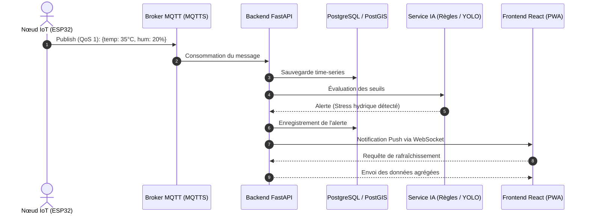

# Chapitre 2 — Étude préliminaire et État de l'art

## Table des matières
1. [2.1 Introduction](#21-introduction)
2. [2.2 Ingénierie des exigences](#22-ingénierie-des-exigences)
   - [2.2.1 Besoins fonctionnels](#221-besoins-fonctionnels)
   - [2.2.2 Besoins non fonctionnels (Techniques et Qualité)](#222-besoins-non-fonctionnels-techniques-et-qualité)
3. [2.3 État de l'art et Revue de la Littérature](#23-état-de-lart-et-revue-de-la-littérature)
   - [2.3.1 Évolution des architectures IoT en agriculture](#231-évolution-des-architectures-iot-en-agriculture)
   - [2.3.2 L'Intelligence Artificielle au service du diagnostic végétal](#232-lintelligence-artificielle-au-service-du-diagnostic-végétal)
   - [2.3.3 Les modèles de langage locaux et le paradigme RAG](#233-les-modèles-de-langage-locaux-et-le-paradigme-rag)
   - [2.3.4 Synthèse critique et lacunes](#234-synthèse-critique-et-lacunes)
4. [2.4 Conception Architecturale Préliminaire](#24-conception-architecturale-préliminaire)
   - [2.4.1 Modélisation Dynamique : Diagramme de Séquence](#241-modélisation-dynamique--diagramme-de-séquence)
   - [2.4.2 Analyse des Risques et Matrice de Sécurité](#242-analyse-des-risques-et-matrice-de-sécurité)
   - [2.4.3 Gouvernance des données, éthique et conformité](#243-gouvernance-des-données-éthique-et-conformité)
5. [2.5 Choix Technologiques et Justifications d'Ingénierie](#25-choix-technologiques-et-justifications-dingénierie)
   - [2.5.1 Couche Matérielle et IoT](#251-couche-matérielle-et-iot)
   - [2.5.2 Couche Backend et Persistance](#252-couche-backend-et-persistance)
   - [2.5.3 Couche Intelligence Artificielle](#253-couche-intelligence-artificielle)
   - [2.5.4 Couche Frontend et Mobilité](#254-couche-frontend-et-mobilité)
6. [2.6 Protocole d'Évaluation et Métriques Scientifiques](#26-protocole-dévaluation-et-métriques-scientifiques)
   - [2.6.1 Design expérimental](#261-design-expérimental)
7. [2.7 Planification du Projet](#27-planification-du-projet)
8. [2.8 Conclusion](#28-conclusion)

---

## 2.1 Introduction

Dans le cycle de vie d'un projet d'ingénierie logicielle et de data science, l'étude préliminaire constitue une phase charnière. Conformément à la méthodologie CRISP-DM choisie au Chapitre 1, ce chapitre couvre principalement les phases de *Business Understanding*, de *Data Understanding*, ainsi qu'une première itération de *Modeling/Design* (architecture globale et choix technologiques). La conception détaillée (modèles de données, diagrammes UML, contrats d'API) sera approfondie au Chapitre 3, et l'évaluation complète fera l'objet du Chapitre 4.

L'objectif de ce chapitre est de formaliser rigoureusement les exigences du système **Smart Farm AI**, de positionner notre approche par rapport aux travaux scientifiques récents (état de l'art), et de justifier avec des arguments d'ingénierie les choix architecturaux et technologiques retenus.

---

## 2.2 Ingénierie des exigences

L'ingénierie des exigences permet de définir les spécifications exactes auxquelles le système doit répondre pour être validé par les parties prenantes (exploitants agricoles, vétérinaires, agents de terrain).

### 2.2.1 Besoins fonctionnels

Les besoins fonctionnels décrivent les actions que le système doit être capable d'exécuter. Pour Smart Farm AI, ils se déclinent en plusieurs sous-systèmes :

1. **Module d'Administration et Multi-Tenancy :**
   - Le système doit gérer de multiples exploitations agricoles (fermes, parcelles, ruchers) de manière isolée.
   - Il doit intégrer une gestion fine des rôles (RBAC) avec des scopes d'accès : Super Admin, Propriétaire de ferme, Vétérinaire/Agronome, et Agent de terrain.

2. **Module d'Acquisition et Supervision IoT :**
   - Le système doit collecter, stocker et afficher en temps réel les données de télémétrie issues des nœuds ESP32 (humidité du sol, température, pression, débit d'eau, poids des ruches).
   - Il doit permettre la configuration à distance des seuils de déclenchement (ex: seuil d'irrigation à 35% d'humidité).

3. **Module d'Intelligence Artificielle et Vision :**
   - Le système doit permettre l'upload d'images (via smartphone ou caméras IP) pour la détection instantanée de maladies foliaires (olivier, agrumes) ou de ravageurs.
   - Le système doit localiser l'anomalie sur l'image via des boîtes englobantes (bounding boxes) et fournir un taux de confiance (confidence score).

4. **Module d'Aide à la Décision (RAG & LLM) :**
   - Le système doit fournir un assistant conversationnel capable d'analyser le contexte de la ferme et de proposer des recommandations agronomiques ou vétérinaires.
   - Cet assistant doit supporter la langue arabe, le français et le dialecte tunisien (Darija).

### 2.2.2 Besoins non fonctionnels (Techniques et Qualité)

Les besoins non fonctionnels définissent les critères de qualité, de performance et de sécurité qui garantissent la viabilité industrielle du produit :

- **Haute Disponibilité et Tolérance aux Pannes (Fault Tolerance) :** Dans les zones rurales tunisiennes, les coupures réseau sont fréquentes. Les nœuds IoT doivent posséder un mode dégradé autonome pour continuer l'irrigation (temps de bascule < 10s), et l'application mobile (PWA) doit fonctionner en mode hors-ligne avec synchronisation différée.
- **Temps Réel et Faible Latence :** Le délai (end-to-end) entre la détection d'une criticité par un capteur et la réception de l'alerte sur le tableau de bord ne doit pas excéder 3 secondes (p95).
- **Scalabilité Horizontale :** L'architecture doit supporter la montée en charge, permettant l'ajout de milliers de capteurs MQTT sans dégradation des performances.
- **Souveraineté, Éthique et Conformité :** Conformité aux lois tunisiennes sur la protection des données personnelles (INPDP). Anonymisation des visages humains sur les images. Les données doivent résider sur un hébergement souverain.

---

## 2.3 État de l'art et Revue de la Littérature

Afin de garantir l'innovation technologique de Smart Farm AI, il est essentiel d'analyser les approches scientifiques actuelles dans les domaines de l'IoT agricole et de la vision par ordinateur.

### 2.3.1 Évolution des architectures IoT en agriculture
Traditionnellement, les systèmes d'irrigation reposaient sur des automates programmables (PLC) coûteux et rigides. Avec l'avènement de l'IoT, la littérature montre une transition vers des microcontrôleurs à bas coût (ESP32, LoRaWAN) couplés à des architectures de type Publish/Subscribe (MQTT) [9]. Cependant, la plupart des solutions cloud existantes souffrent d'une forte dépendance à une connectivité continue, ce qui pose problème en milieu rural [10].

### 2.3.2 L'Intelligence Artificielle au service du diagnostic végétal
La détection de maladies par vision par ordinateur a connu un bond majeur avec les réseaux de neurones convolutifs (CNN). Les architectures comme ResNet ou Faster R-CNN offrent une grande précision, mais au détriment de la vitesse d'inférence [11]. Récemment, la famille **YOLO (You Only Look Once)**, particulièrement ses versions optimisées pour l'Edge (YOLOv8), s'est imposée grâce à son architecture *Single-Shot* garantissant un traitement en temps réel même sur des équipements à ressources limitées [12].

### 2.3.3 Les modèles de langage locaux et le paradigme RAG
Le déploiement de modèles génératifs en agriculture s'est souvent heurté au problème des "hallucinations". La littérature démontre que le paradigme **RAG (Retrieval-Augmented Generation)** résout ce problème en forçant le LLM à se baser sur une base de données vectorielle de documents validés (guides agricoles) avant de générer sa réponse [13].

### 2.3.4 Synthèse critique et lacunes
Malgré la richesse de la littérature, la majorité des approches existantes traitent ces domaines en silos (soit purement IoT, soit purement IA). De plus, les solutions commerciales sont souvent propriétaires, coûteuses et anglophones.

**Tableau 2.1 — Synthèse critique de l'état de l'art et positionnement de Smart Farm AI. Source : auteur.**

| Solutions / Approches | Coût | Inférence IA | Connectivité requise | Souveraineté | Langue / Contexte local |
| :--- | :--- | :--- | :--- | :--- | :--- |
| **John Deere Operations** | Élevé | Cloud (Propriétaire) | Continue | Faible (Cloud US) | Anglais / Agric. intensive |
| **Plantix (Application)** | Faible | Cloud | Continue | Faible | Français/Anglais, sans IoT |
| **CNN classiques (ResNet)** | Modéré | Serveur GPU lourd | N/A | Variable | N/A |
| **LLM Fine-Tuned** | Très élevé | Cloud / Lourd | Continue | Variable | Risque d'hallucination |
| **Smart Farm AI** | **Faible (<30€/nœud)** | **Edge/Serveur (YOLOv8)** | **Tolérance offline (PWA)** | **Forte (On-premise)** | **Darija, RAG contextualisé** |

L'apport principal de Smart Farm AI réside dans l'intégration synergique de ces technologies abordables dans une plateforme unifiée, hors-ligne et culturellement adaptée (Darija/Arabe).

---

## 2.4 Conception Architecturale Préliminaire

Pour satisfaire le cahier des charges, nous avons conçu une architecture orientée services (SOA) découpée en quatre couches logiques garantissant le découplage, la maintenabilité et la scalabilité du système.

### 2.4.1 Modélisation Dynamique : Diagramme de Séquence

Le diagramme de séquence ci-dessous modélise le flux critique d'acquisition d'une donnée de télémétrie, son évaluation par l'intelligence artificielle, et la restitution à l'utilisateur final.

**Figure 2.1 — Diagramme de séquence (acquisition IoT → analyse IA → notification temps réel). Source : auteur.**

*Interprétation : Ce flux asynchrone permet au Backend de ne pas être bloqué par l'analyse. L'utilisation de MQTT avec Qualité de Service (QoS) 1 garantit la délivrance du message, tandis que les WebSockets informent l'agriculteur en temps réel.*

### 2.4.2 Analyse des Risques et Matrice de Sécurité

Dans un système IoT industriel contrôlant des vannes d'eau, la cybersécurité est une préoccupation vitale.

**Tableau 2.2 — Matrice des risques et protections technologiques. Source : auteur.**

| Vulnérabilité / Risque | Impact | Probabilité | Mesure de mitigation technologique implémentée |
| :--- | :--- | :--- | :--- |
| **Sniffing des données** | Critique | Élevée | Chiffrement TLS/SSL (HTTPS/WSS) via Caddy. MQTT over TLS (MQTTS). |
| **Spoofing IoT** | Élevée | Moyenne | Certificats MQTT par nœud et listes de contrôle d'accès (ACL). |
| **Usurpation d'identité** | Critique | Moyenne | Authentification JWT avec durée courte de token et liste de révocation (denylist Redis). |
| **Déni de Service (DDoS)** | Moyenne | Moyenne | Rate Limiting sur les endpoints FastAPI. Validation stricte via Pydantic. |

### 2.4.3 Gouvernance des données, éthique et conformité

Le projet intègre nativement le concept de *Privacy by Design* :
- **Conformité Légale :** Respect strict du cadre légal tunisien (loi de l'INPDP).
- **Rétention et Anonymisation :** Les images soumises par les agriculteurs sont scannées pour flouter les visages et les plaques d'immatriculation avant stockage. Une politique de rétention supprime les logs bruts après 12 mois.
- **Sécurité de l'IA (RAG) :** Les prompts utilisateurs sont nettoyés (sanitization) pour éviter les attaques par *Prompt Injection*. Le système RAG restreint la recherche vectorielle aux seuls documents appartenant au *tenant* (l'exploitation agricole) de l'utilisateur.

---

## 2.5 Choix Technologiques et Justifications d'Ingénierie

### 2.5.1 Couche Matérielle et IoT
- **Microcontrôleur ESP32 :** Offre nativement le Wi-Fi, possède une puissance de calcul suffisante pour du *Edge Computing* léger, et supporte le mode *Deep Sleep* pour l'économie d'énergie (sur batterie solaire), à un coût unitaire < 5€.
- **Protocole MQTT :** Orienté événements, avec gestion native de la Qualité de Service (QoS 0/1/2) et du mécanisme "Last Will and Testament" (LWT) pour détecter la mort d'un nœud. Les topics sont structurés logiquement (`farm/{id}/node/{id}/telemetry`).

### 2.5.2 Couche Backend et Persistance
- **FastAPI (Python) :** Bâti sur l'asynchronisme natif d'Uvicorn (ASGI). Il offre des performances I/O supérieures et s'interface nativement avec l'écosystème IA (PyTorch) sans surcoût réseau.
- **PostgreSQL avec PostGIS :** SGBD relationnel le plus robuste. PostGIS (SRID EPSG:4326 avec index GiST) gère efficacement les polygones de parcelles et les requêtes spatiales géolocalisées.

### 2.5.3 Couche Intelligence Artificielle
- **Ultralytics YOLOv8 :** Modèle exportable (ONNX/TensorRT) pour inférence rapide sur CPU/GPU, offrant un excellent rapport mAP / FPS.
- **Ollama & ChromaDB (RAG) :** Déploiement local souverain. Le chunking des textes (taille adaptée avec chevauchement) et les métadonnées ChromaDB assurent des réponses ultra-ciblées, sans fuite de données vers des API Cloud étrangères.

### 2.5.4 Couche Frontend et Mobilité
- **React 18 & Vite JS :** Développement par composants réutilisables.
- **PWA offline (Workbox & Dexie.js) :** Stratégie de Service Worker robuste gérée par Workbox. Une file d'attente (IndexedDB) stocke les actions utilisateur (ex: rapports de visite) hors-ligne, avec un mécanisme de synchronisation en arrière-plan et de gestion des conflits (dernière-écriture-gagnante) lors de la reconnexion.

---

## 2.6 Protocole d'Évaluation et Métriques Scientifiques

### 2.6.1 Design expérimental

Pour assurer la validité scientifique, nous avons défini les protocoles d'évaluation suivants, dont les résultats détaillés feront l'objet du Chapitre 4 :

1. **Évaluation de la Vision Artificielle (YOLOv8) :**
   - **Dataset :** Images collectées en serre tunisienne et enrichies par des banques de données. Séparation stratifiée (Train 70%, Val 15%, Test 15%).
   - **Métriques :** Évaluation sur `mAP@0.5` et `mAP@0.5:0.95`. Analyse de Precision, Recall et F1-Score par classe pour pénaliser les Faux Positifs coûteux.
   - **Baseline :** Comparaison des performances de YOLOv8 face à une architecture ResNet50 standard.
   
2. **Évaluation du système IoT Temps Réel :**
   - **Scénarios de stress :** Simulation de perte de connectivité (Wi-Fi) et observation du délai de basculement en mode autonome (objectif < 10s). Outil utilisé : `mqtt-stresser`.
   - **Métriques :** Mesure de la latence de bout en bout (capteur → alerte UI) sur les percentiles p95 et p99.

3. **Évaluation PWA Hors-ligne :**
   - **Scénarios :** Saisie de rapports vétérinaires en mode avion (simulation de perte réseau rurale), puis reconnexion.
   - **Métriques :** Taux de succès de la synchronisation différée (absence de perte de données) et temps de synchronisation (`time-to-sync`).

---

## 2.7 Planification du Projet

La méthodologie CRISP-DM choisie se marie idéalement avec une gestion de projet itérative (Agile).

**Tableau 2.3 — Macro-planification des Sprints du projet Smart Farm AI. Source : auteur.**

| Phase / Sprint | Objectifs clés d'ingénierie | Livrables techniques |
| :--- | :--- | :--- |
| **Phase 1 : Cadrage & Socle** | Architecture BD, CI/CD, JWT. | Schéma PostGIS, API de base, Docker. |
| **Phase 2 : Couche IoT** | Firmware ESP32, Broker MQTTS. | Dashboard télémétrie temps réel. |
| **Phase 3 : Moteurs d'IA** | YOLOv8, ChromaDB, Ollama. | Modèles `.pt`, Pipeline RAG, UI Assistant. |
| **Phase 4 : Modules ERP** | Interfaces Aviculture/Apiculture. | Frontend React, Cartographie intégrée. |
| **Phase 5 : Déploiement** | Tests de charge, Mode hors-ligne. | PWA finale, Rapport d'évaluation. |

---

## 2.8 Conclusion

L'étude préliminaire détaillée dans ce chapitre a permis de traduire les problématiques du monde agricole en spécifications d'ingénierie concrètes et mesurables. La revue de la littérature a orienté nos choix vers des technologies de pointe (YOLOv8, RAG, MQTT) tout en évitant les écueils des systèmes fermés et dépendants du cloud. 

Les choix architecturaux et technologiques retenus (FastAPI, React, ESP32) constituent un socle robuste, sécurisé, éthique et hautement scalable. Le design expérimental rigoureux mis en place garantit la testabilité de la solution. Cette fondation technologique solidement argumentée permet d'aborder sereinement la phase de conception détaillée (UML, Modèles de données, Contrats d'API) et d'implémentation qui fera l'objet du chapitre suivant.
